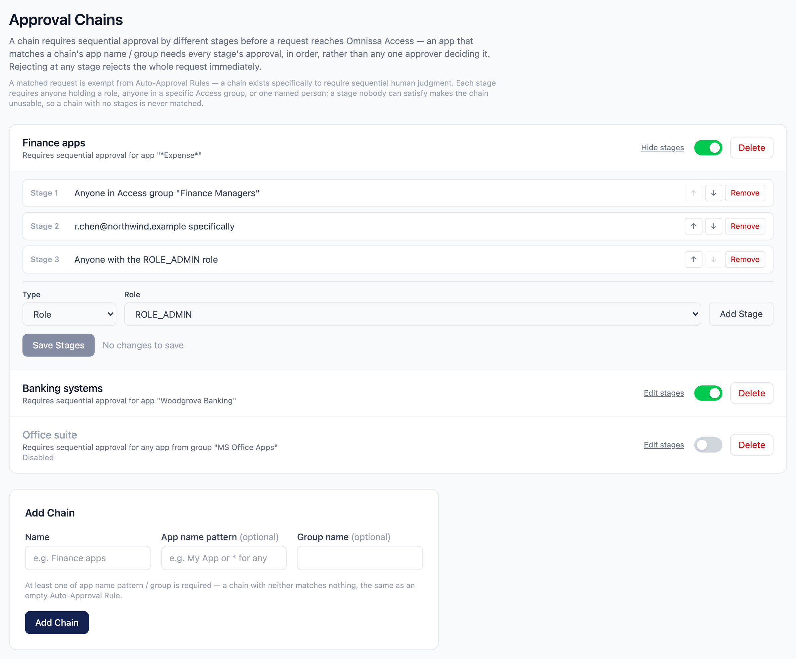
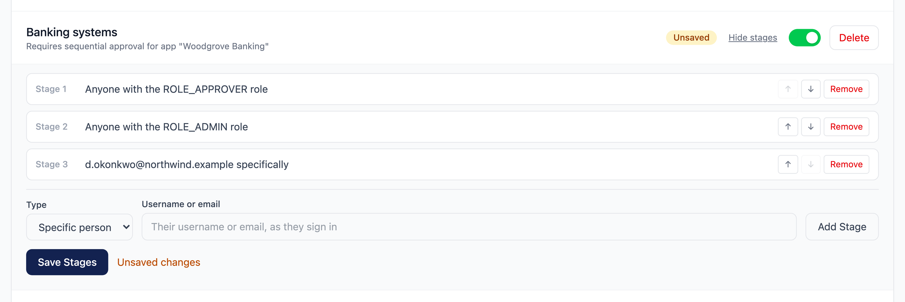
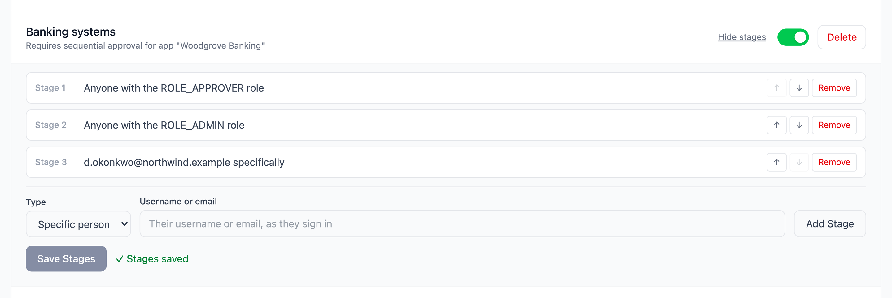

# Multi-Stage Approval Chains

A chain requires **sequential approval by different stages** — matched by
application-name pattern and/or Access group — before a request reaches
Omnissa Access, instead of any one approver deciding it outright.

> Not an Omnissa product — see [NOTICE.md](../NOTICE.md). Intended for
> testing/demo use only.

## How it works

1. Omnissa Access posts a callout; if it matches an enabled chain (by
   application-name pattern and/or Access group, the same matching auto-rules
   use), the request is routed into that chain at stage 1 instead of the
   ordinary single-decision flow.
2. **A chain-matched request is exempt from Auto-Approval Rules** — a chain
   exists specifically to require sequential human judgment, so a MATCH
   auto-rule is never allowed to auto-decide it on arrival.
3. Approving the current stage:
   - If it is **not** the chain's final stage, nothing is sent to Omnissa
     Access. The request stays in `pending`, `currentStage` advances by one,
     and whoever is eligible for the new stage is notified (see below).
   - If it **is** the final stage, the decision is delivered to Access exactly
     like an ordinary approval — the JIT/TTL options apply the same way.
4. **Rejecting at any stage rejects the whole request immediately** —
   short-circuits straight to Access, the same as an ordinary decline.

## Managing chains

Chains are managed on the **Chains** page (administrators only — readable by
Admin/Approver/Viewer, same as Auto-Approval Rules).

- **Name**, an optional **app name pattern** (`*` wildcard, same syntax as
  auto-rules) and an optional **Access group** — at least one of the two
  criteria is required, or the chain matches nothing (the same reasoning that
  makes an empty MATCH auto-rule select nothing rather than everything).
- An ordered list of **stages**, each requiring either:
  - **A role** — `ROLE_ADMIN`, `ROLE_APPROVER`, `ROLE_VIEWER` or
    `ROLE_AUDITOR`. Eligibility is a local check against the acting session's
    granted authorities; no Access API call.
  - **An Access group** — any user resolved as a member of that group, live,
    via SCIM. Read the group id the same place `OMNISSA_ROLE_MAP` ids come
    from: sign in and open `GET /api/auth/claims`.
  - **A specific person** — matched against the acting session's own identity
    (their username or email as they sign in). Unlike a group stage this works
    for local accounts. It is also the narrowest option, and therefore the only
    one that becomes undecidable when that person leaves or changes how they
    sign in — administrators can always decide any stage, which is what stops
    that being a dead end. Prefer a role or a group wherever a team, rather
    than a named individual, is what you actually mean.
- **A chain with no stages is never matched** — it would create a request
  nobody is eligible to decide, so it's skipped rather than routed to it.

### Saving stages

Editing the stage list does not change anything about matching until it is
saved. Adding, removing or reordering a stage marks the chain **Unsaved** and
the button says so; a save replaces the chain's whole stage list in one
transaction, then confirms.

### Who may decide a stage

- **Admins may always decide any stage of any chain** — the same break-glass
  precedent used elsewhere in this tool, so a chain whose stage requirement can
  no longer be satisfied (e.g. an Access group was deleted) is never a dead
  end.
- A **role** stage: anyone whose session holds that role.
- A **group** stage: anyone resolved, live, as a member of that Access group.
  **Local (non-OIDC) accounts can never satisfy a group stage** — they carry no
  Access group membership to check, so this fails closed for them by design.
- Deciding a stage you are not eligible for returns `403` with a message
  naming the requirement.

### Notifications

Whoever is eligible for the current stage is pushed a **Hub Notification**
when a request first enters a chain and after every stage advance, if Hub
Notifications is available on your tenant (unavailable tenants are logged and
skipped, not treated as an error).

- **Role stage recipients**: every Access group mapped to that role in
  `OMNISSA_ROLE_MAP`, resolved to their members — reuses the role map you
  already have, no separate recipient list to maintain.
- **Group stage recipients**: that group's members, directly.
- These notifications are **informational only**. Deciding a request always
  happens by signing in to this tool — never from an action button on the
  notification itself. This is deliberate: a decision made from a notification
  surface is a second, unauthenticated path to authority that can drift from
  (and outlive) the real one, the exact reasoning that keeps Slack/Teams
  approvals as deep links rather than inline callbacks.

## What's not here yet

- **No per-stage timeout or escalation.** A stage nobody acts on is covered
  only by the ordinary whole-request expiry auto-rule, exactly like an
  unstaged pending request.
- **Bulk "decide all pending" skips chained requests.** Deciding a specific
  stage's approver can't be a bulk action by definition; a chained request is
  logged and left for individual decision.

## Audit trail

Every chain decision is recorded:

- `chain-matched` — a request was routed into a chain, naming the chain and
  stage count.
- `stage-approved` — a stage was approved, naming the stage number, the
  decider, and the stage it now awaits.
- The final stage's decision is audited exactly like any other approval or
  rejection.
