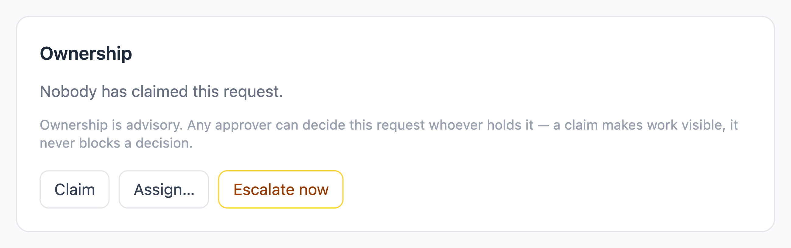
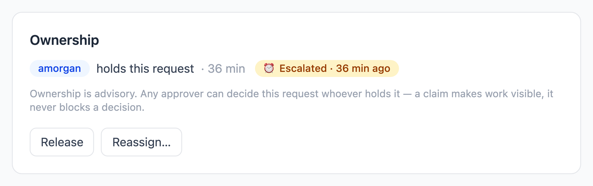
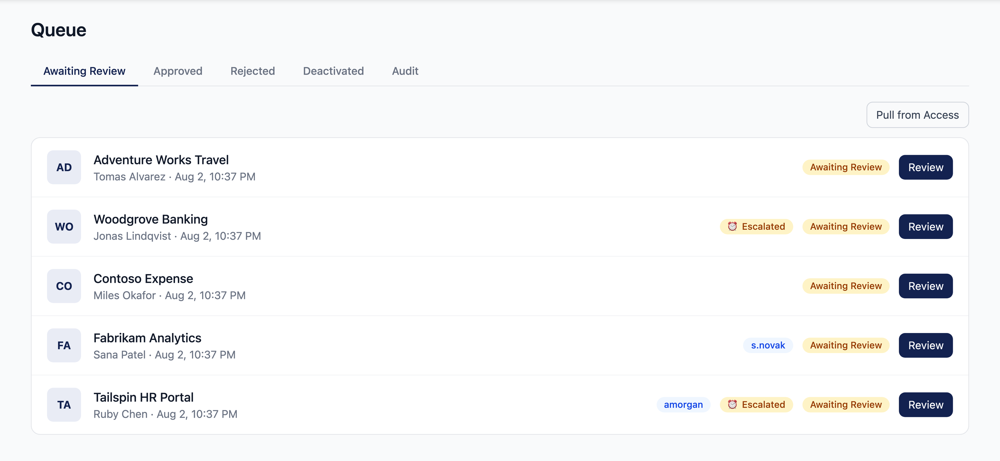
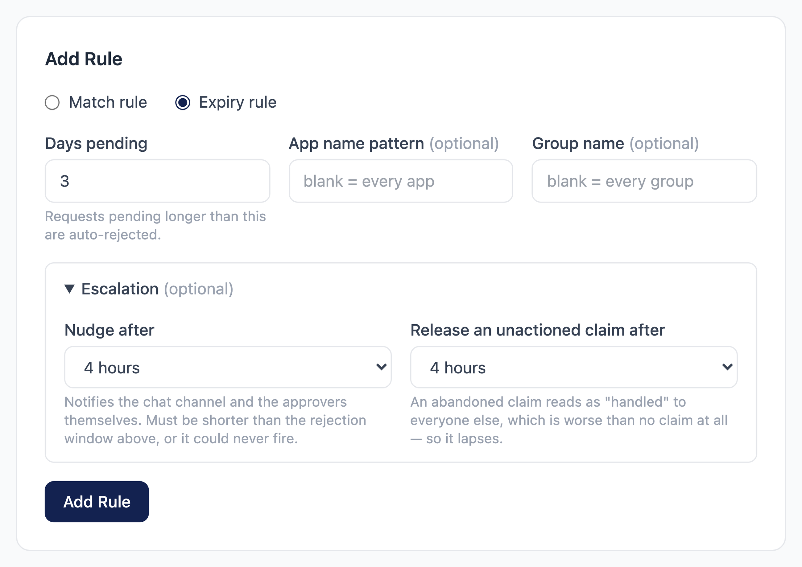
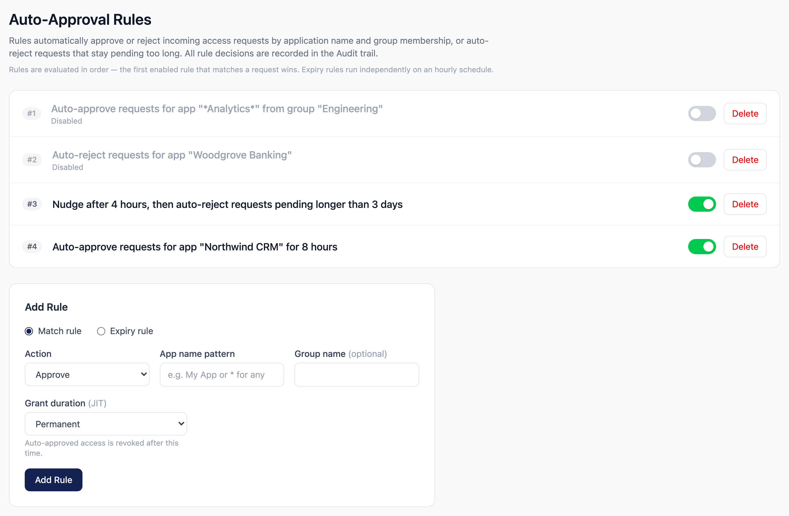
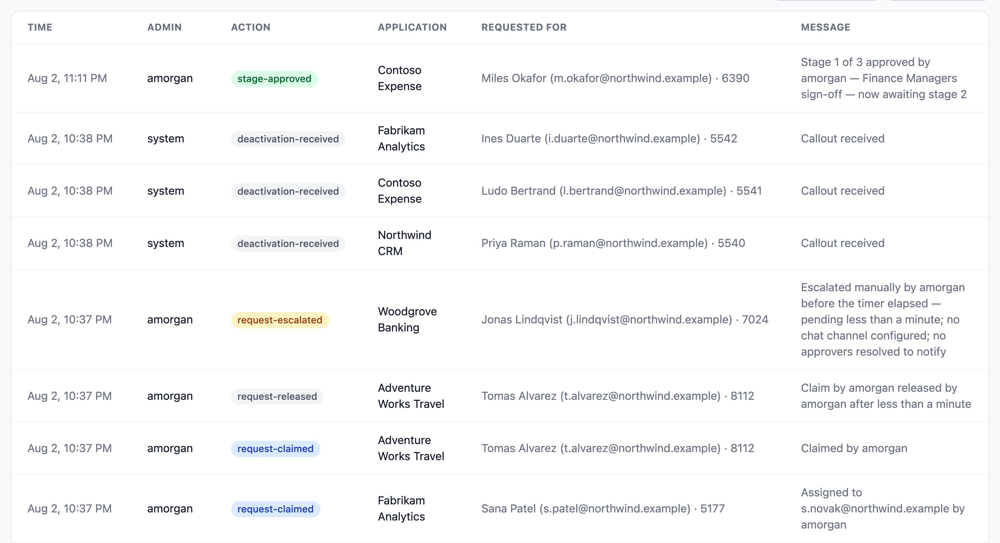

# Ownership and Escalation

A request nobody attends to used to have exactly one outcome: the expiry rule
auto-rejected it after N days, and the requester found out by being denied.
Nobody was told the queue was being ignored. This is the missing middle.

> Not an Omnissa product — see [NOTICE.md](../NOTICE.md). Intended for
> testing/demo use only.

## Ownership: Claim, Assign, Release

On a pending request an approver can:

- **Claim** it — take visible ownership. The owner shows as a badge in the queue.
- **Assign** it to a named approver, chosen from the live approver list.
- **Release** it back to the pool.

### Ownership is advisory, never authorization

**Any approver can decide any request no matter who holds it.** This is
deliberate and load-bearing. A claim that could block a decision would make a
request undecidable the moment its owner went on leave — a convenience turned
into an outage — and it would put decision authority in a column Omnissa Access
has never heard of.

Consequences of that rule, all intentional:

- The Review button stays available to every approver, whoever holds the request.
- Claiming does **not** steal a claim somebody else holds (you get a clear
  conflict instead).
- **Any** approver may release **any** claim, so a request is never welded to
  somebody who has left the organisation.
- Assigning carries no obligation. Escalation still fires on schedule, and an
  assignment nobody actions is auto-released exactly like an abandoned
  self-claim, rather than parking the request behind one person indefinitely.

The approver list in the Assign picker is resolved **live** from the Access
groups mapped to the Approver and Admin roles in `OMNISSA_ROLE_MAP`. There is no
separate approver list to maintain, and nothing to drift out of step with
Access — somebody removed from the group stops appearing on the next call.

The owner badge and the escalation chip are both readable from the queue
without opening a request, which is what makes an unattended one findable:

## Escalation

Escalation is configured on an **expiry rule**, in its optional *Escalation*
section, so one rule reads *"nudge after 4 hours, then auto-reject after 3
days"*. Mature tools keep escalation in a separate policy object because many
services reference one policy; a tenant here has one expiry rule, so a second
table and CRUD page would be more configuration, not less.

When a matching request has been pending past the threshold, the tool:

1. Posts a visually distinct nudge to the chat channel (`⏰ Still waiting …`) —
   rendered identically to a new request, five escalations would read as five
   *new* requests, which is worse than noise.
2. Pushes a **Hub Notification** to the approvers themselves, resolved live from
   the role map.

The rules list then states the whole policy in one row — a scoped rule rejects
far less than an unscoped one, and the row is the only place that is visible:

### Scoping

Escalation honours the rule's own **application-name pattern** and **group**,
using the same matcher the expiry sweep uses. *"Nudge Finance apps after 4
hours"* is expressible without escalating everything. Leaving both blank — the
usual case — escalates every stale request.

### Guarantees

- **Each request escalates once.** A counter, not a flag, so a second stage
  needs no schema change later.
- **A request decided mid-sweep is skipped**, not nudged. Without that re-check
  the channel would be told "nobody has acted on this" about a request approved
  ninety seconds earlier.
- **Notify first, then record.** A crash between the two re-sends a nudge; the
  reverse order would record a stage that never fired and — because each stage
  fires exactly once — never fires again. A duplicate nudge is bounded noise; a
  missed summons is the failure this exists to prevent.
- **The audit trail states what actually happened**, including when nothing was
  configured to receive the nudge. It never claims a notification it did not
  send. A total delivery failure leaves the request un-escalated so the next
  sweep retries it.
- **A per-pass cap of 50**, remainder deferred and logged — enabling a rule
  against an existing backlog must not escalate hundreds of requests at once.

### Escalate now

**Escalate now** on the request detail page skips the remaining timer. It is not
a demo convenience: escalation is otherwise unobservable until it fires, so this
is the only way an administrator can confirm a rule is wired up correctly
without waiting. It advances the same counter the timed sweep uses, so the timed
stage never re-fires, and it is audited with the administrator as the actor and
wording that says the timer had *not* elapsed — the trail must never imply a
timer fired when a human pressed a button.

### Claim TTL

An unactioned claim is released automatically after its own interval (defaulting
to the escalation interval). The failure this prevents is specific: an approver
claims a request at 17:00 and goes home; a second approver sees the owner badge,
reads it as handled, and does nothing. **An abandoned claim is a worse signal
than no claim at all.** The release is audited as `system`, which is what
distinguishes a lapse from somebody manually releasing it.

## Scheduling and health

Escalation runs on **its own thread pool**, separate from the sweeps that expire
time-bound access.

This is the only job in the tool with a dedicated pool, and it earns it. Every
other scheduled job shares one thread, and escalation is the first that must
make answer-bearing network calls — resolving the approver pool over SCIM and
pushing notifications — while needing the result synchronously so a failed
delivery can be retried rather than recorded as a summons that never happened.
On the shared thread those requirements conflict: a slow tenant would stall JIT
expiry, and that fails silently — time-bound access would simply never expire
while every health check stayed green.

Escalation's own liveness is reported alongside the other jobs at
`/api/health/dependencies`, with a 20-minute tolerance. Reusing the hourly
tolerance would hide a 35-cycle stall.

## Audit trail

| Action | Meaning |
|---|---|
| `request-claimed` | Claimed, or assigned to a named approver |
| `request-released` | Released — names the owner, how long they held it, and whether a person or the TTL did it |
| `request-escalated` | Escalated, naming the rule, how long it had been pending, and exactly what was reached |

Each carries its own colour in the trail, alongside the two written by
[approval chains](approval-chains.md):

## What is not here

- **No second escalation stage.** The counter supports one today.
- **No email escalation.** Deliberately deferred — see the note in
  `docs/design/51-delegation-escalation.md`.
- **No per-stage escalation inside an approval chain.** A stuck chain stage is
  covered only by the whole-request expiry rule.
