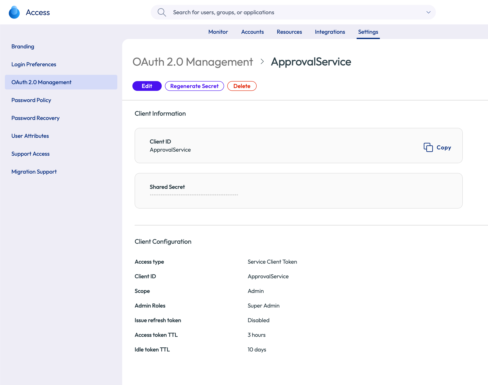
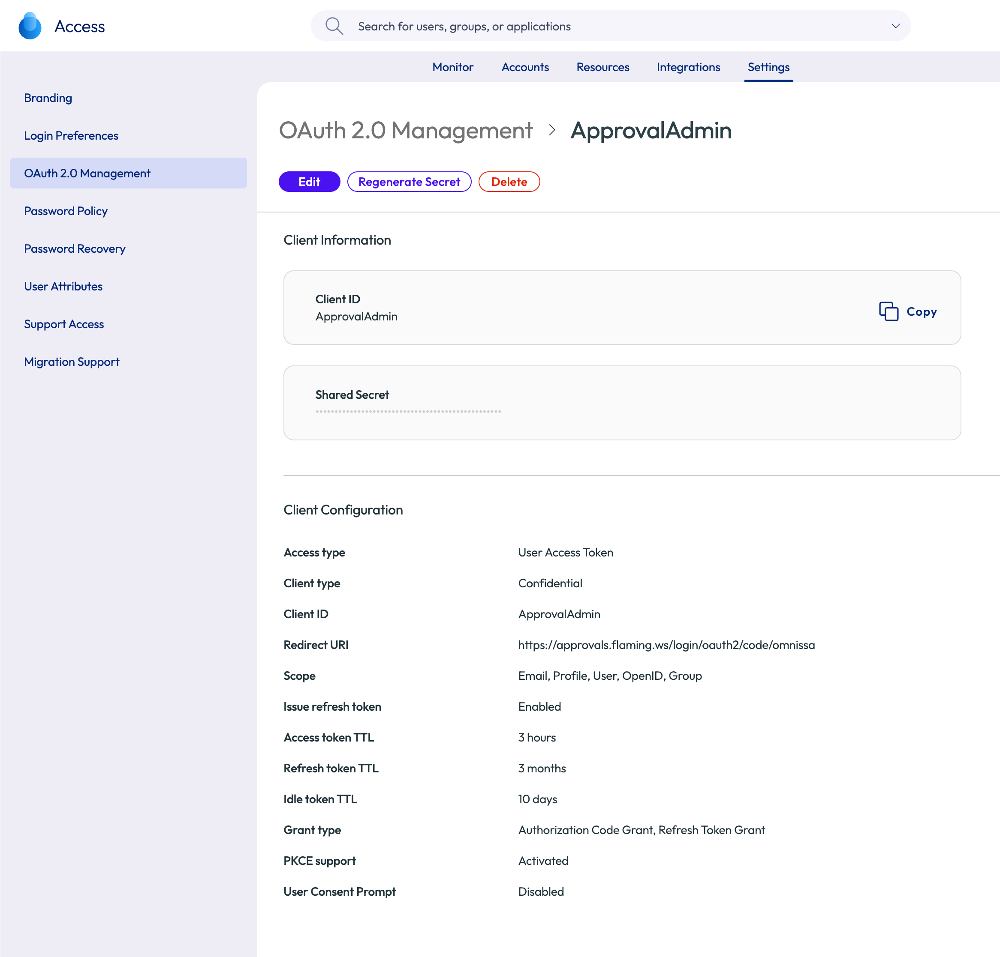
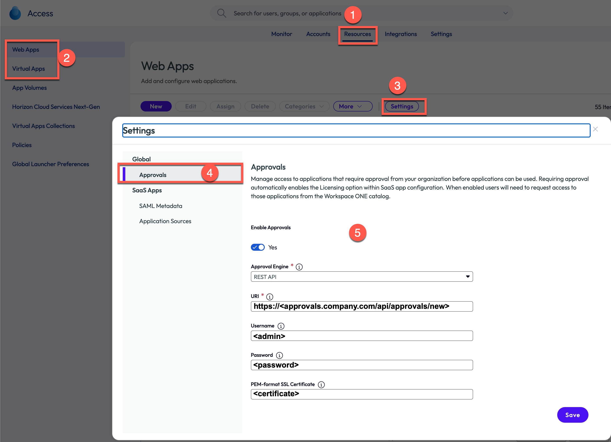
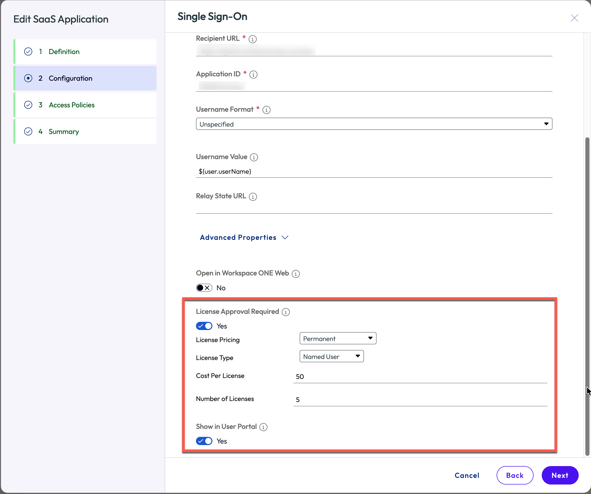
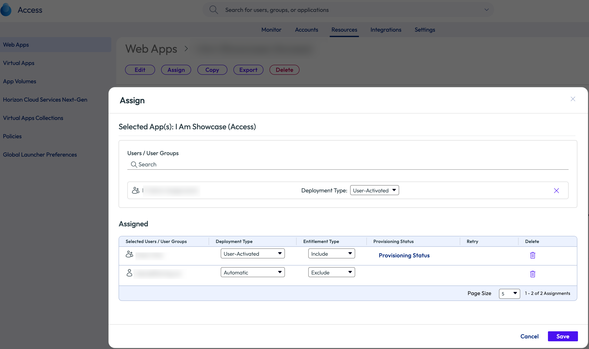
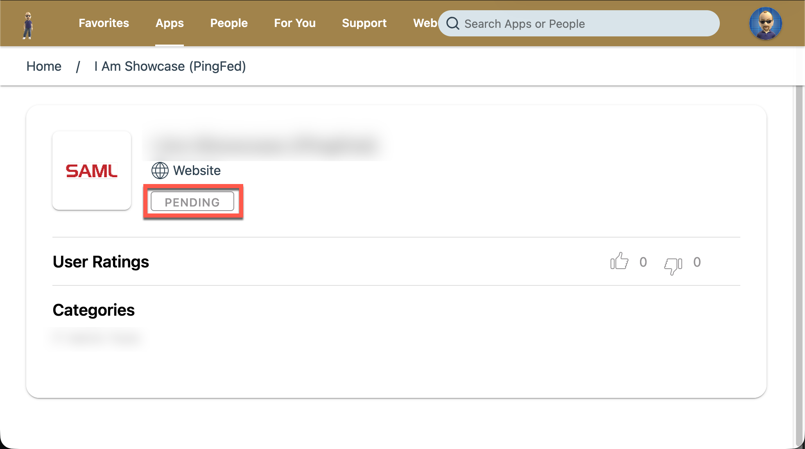
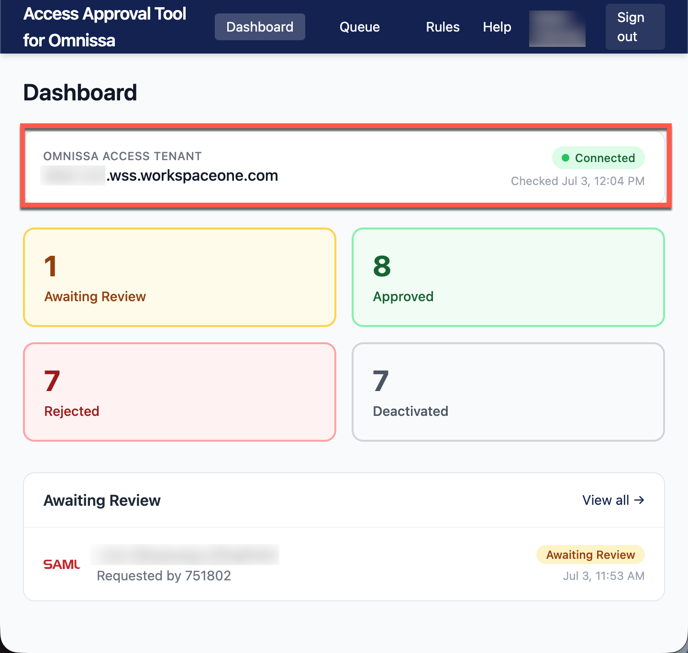
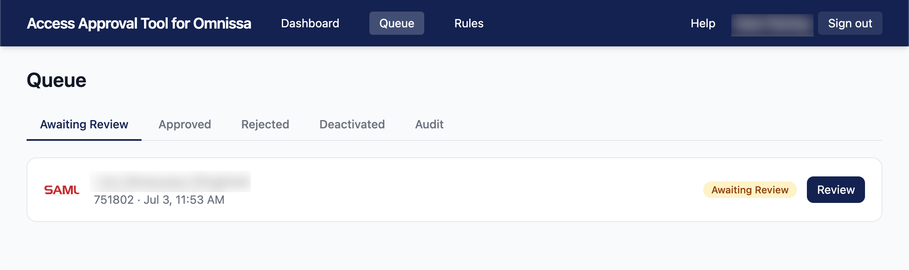

# Omnissa Access Tenant Setup

This walkthrough configures an Omnissa Access tenant to send approval
callouts to the Access Approval Tool for Omnissa and (optionally) to act as
the OIDC identity provider for admin login.

You need administrator access to the Omnissa Access console, and the tool
must already be deployed with a publicly reachable HTTPS endpoint for
`/api/approvals/new` — see [deployment](deployment.md).

## 1. Create the Service Client (approvals API)

This client lets the tool post approval decisions back to Omnissa Access and
powers the dashboard connectivity check.

1. In the Omnissa Access console, create a new OAuth client under
   **Settings > OAuth 2.0 Management**:
   - **Client type:** Service Client / Service Access Token
   - **Grant type:** Client Credentials
   - Suggested name: `ApprovalService`
2. Copy the **Client ID** and **Client Secret** into:
   - `OMNISSA_BOOTSTRAP_CLIENT_ID`
   - `OMNISSA_BOOTSTRAP_CLIENT_SECRET`
3. Set `OMNISSA_BOOTSTRAP_URL` to the tenant hostname (no scheme), e.g.
   `tenant.us1.wss.workspaceone.com`.



> If you plan to use `OMNISSA_ADMIN_OAUTH_DISABLE_CONSENT=true` (step 5),
> this service client needs admin rights in the tenant.

## 2. Create the OIDC Admin Login Client (optional)

Lets administrators sign in to the tool with their Omnissa Access
credentials.

1. Create a second OAuth client:
   - **Client type:** User Access Token (**confidential**)
   - **Grant type:** `authorization_code` — PKCE enforced by Access is
     supported by the tool
   - **Scopes:** `openid`, `email`, `profile`
   - **Redirect URI:** `https://<your-host>/login/oauth2/code/omnissa`
     (the public hostname of the tool — this must match
     `OMNISSA_ADMIN_OAUTH_REDIRECT_URI` exactly)
   - Suggested name: `ApprovalAdmin`
2. Copy the **Client ID** and **Client Secret** into
   `OMNISSA_ADMIN_OAUTH_CLIENT_ID` / `OMNISSA_ADMIN_OAUTH_CLIENT_SECRET`.
3. Set `OMNISSA_ADMIN_OAUTH_ISSUER_URI` to `https://<tenant>/SAAS/auth` —
   the `issuer` value advertised in the tenant's
   `/.well-known/openid-configuration`, **not** `/acs`.
4. **Restrict which users may authenticate through this client** — every
   user who signs in through it receives full admin access to the tool.



## 3. Configure Settings > Approvals

In the Omnissa Access console, go to **Resources > Web Apps > Settings >
Approvals**:



- **Enable Approvals:** on
- **Approval Engine:** REST API
- **URI:** `https://<your-host>/api/approvals/new`
- **Username / Password:** only required if you enabled API Basic auth on
  the tool (`OMNISSA_API_USERNAME` / `OMNISSA_API_PASSWORD`) — enter the
  same values here. Otherwise leave blank.

When you save, Access probes the URI with an `OPTIONS` request — the tool
answers it unauthenticated, so saving works even with Basic auth enabled. If
saving fails with "Unable to connect to the URI", see
[troubleshooting](troubleshooting.md).

## 4. Put Applications Behind Approval

For each application that should require approval:

1. Add or edit the application with **License Approval Required** enabled.
   License Pricing and Type (cost, number of licenses) are optional.

   
2. Choose the assignment **deployment type** — it determines the flow:

   
   - **User-Activated** — the user requests the app from the catalog: they
     open the app's details and click **REQUEST**. The app shows
     **PENDING** while admins approve or decline in the tool. Approved →
     the app becomes available to launch; declined → the app is deactivated
     and appears in the tool's Deactivated list.

     
   - **Automatic** — the approval request is sent to the tool automatically;
     once approved, the application appears for the user.
   - **Excluded** — the application is deactivated, hidden from the user's
     catalog, and appears in the tool's Deactivated list.

## 5. Consent Screen Auto-Disable (optional)

If **User Consent Prompt** is enabled on the OIDC admin client, admins see a
consent screen on their first OAuth2 login. Harmless, but unnecessary for an
internal tool you control. Once OAuth2 login is confirmed working, set:

```bash
OMNISSA_ADMIN_OAUTH_DISABLE_CONSENT=true
```

and restart — at startup the tool calls the Omnissa Access admin API (via
the service client, which must have admin rights) and disables the prompt
automatically. Until this is set, the startup log reminds you of the option
on every run.

## Verify

- The dashboard **Access Connectivity** tile turns green when the service
  client can fetch a token (result cached ~60 s).

  
- Request an app as a test user — it should appear in the tool's queue
  within seconds (live via SSE).

  
- Approve it and confirm the app activates for the user in Access.
