**Repository:** <https://github.com/SquidlyMan/Omnissa-Access-Approvals>
**Container:** `ghcr.io/squidlyman/omnissa-access-approvals`

> ### ⚠️ LEGAL & NON-PRODUCTION DISCLAIMER
>
> **This tool is provided as-is, without warranty of any kind, for testing and
> demonstration of Omnissa Access application approvals only.** It is **not** an
> official Omnissa product and is **not supported by Omnissa**.
>
> **Do not use in production or with production data.** The tool modifies real
> application entitlements in whichever tenant it is configured against.
>
> **All use is entirely at your own risk.** "Omnissa" and "Workspace ONE" are
> trademarks of Omnissa, LLC, used here only to describe interoperability.

---

## 1. Introduction

The Access Approval Tool for Omnissa is a self-hosted approval gateway for the
application-approval capability built into Omnissa Access (formerly VMware
Workspace ONE Access). When approvals are enabled in an Access tenant, users
must request certain catalog applications before launching them, and Access
sends each request to an external REST endpoint for a decision. Access itself
ships no reviewer interface for these requests — an external service must
receive them, present them to a human (or a rule), and post the decision back.

This tool fills that gap. It receives approval callouts from your tenant,
presents them in a live web queue, lets administrators decide each one from a
desktop or a phone, and returns every decision to Access through the tenant's own
API. Around that core loop it adds a full access lifecycle, role-based access
control, an audit trail, auto-approval rules, chat integration, health
monitoring and operational tooling.

### 1.1 Architecture at a Glance

- **Backend:** Spring Boot (Java 17) with an embedded H2 file database — no
  external database required.
- **Frontend:** React + TypeScript single-page app (Vite, Tailwind), served by
  the same container, fully responsive on phones.
- **Packaging:** a single Docker image published to GitHub Container Registry on
  every merge; all state lives on one mounted volume (`/app/data`).
- **Integration:** two OAuth clients in your Access tenant — a service client for
  posting decisions, and an OIDC client for administrator sign-in and role
  resolution.

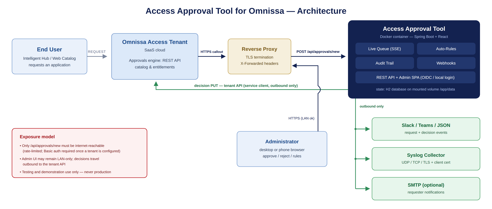

*Figure 1 — request flow, decision delivery, and integration points. Only the
callout path requires internet exposure.*

---

## 2. Feature Reference

### 2.1 Approval Queue

The Queue page shows every request under five tabs: Awaiting Review, Approved,
Rejected, Deactivated, and Audit. New requests appear live through Server-Sent
Events — no refresh needed. Each pending row offers a Review dialog with
Approve/Reject, an access duration, and an optional message returned to the
requester.

### 2.2 Dashboard and Tenant Connectivity

The Dashboard summarizes request counts by state and lists items awaiting
review. A tenant status tile performs a live service-client token check against
your Access tenant (cached for sixty seconds) and displays Connected or
Unreachable — catching expired client secrets before they cause silent failures.

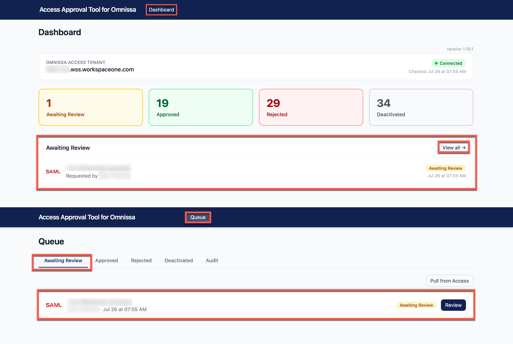

*Figure 2 — the Dashboard (top) with the tenant tile and state counts, and the
Queue (bottom) with its five tabs.*

### 2.3 Access Lifecycle

This is the heart of the tool beyond simple approve/reject.

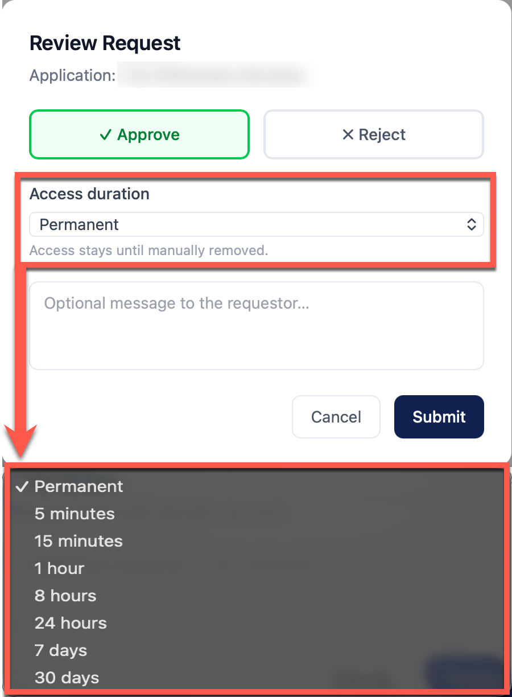

*Figure 3 — the Review dialog: approve or reject, an access duration from
permanent through 5 minutes to 30 days, and an optional message returned to the
requester.*

**Time-bound (JIT) grants.** An approval can be permanent or time-bound —
5 minutes through 30 days. When the TTL elapses, a sweep running every minute
revokes the entitlement in Omnissa Access, which genuinely deprovisions the
application for that user.

**After-expiry policy.** A time-bound grant is either *re-requestable* (the
exclusion is lifted after a short hold and the app returns to the catalog as
requestable) or *one-time* (the exclusion stays and the app does not reappear).

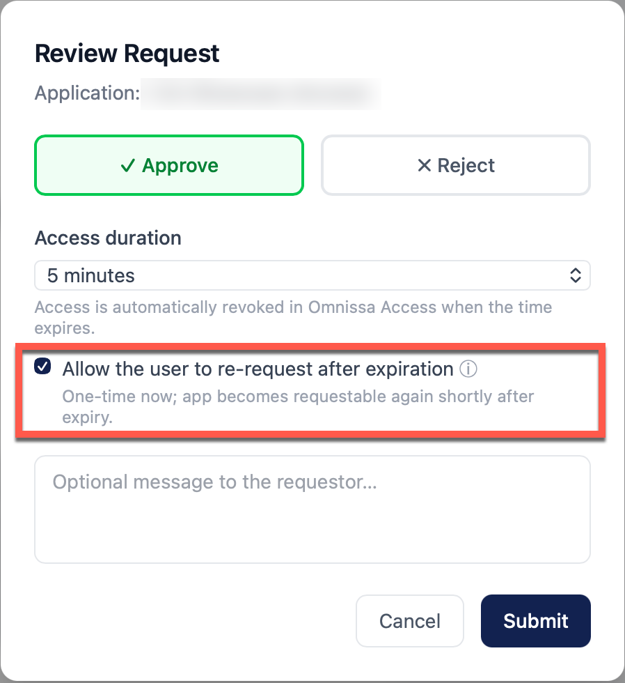

*Figure 4 — choosing a duration reveals the after-expiry policy. Ticked, the app
becomes requestable again shortly after expiry; cleared, the grant is one-time
and the app does not return.*

**Decline modes.** A plain **Reject** is temporary — the user may request the
app again. **Reject and block** additionally excludes the user in Access so the
application does not reappear for them.

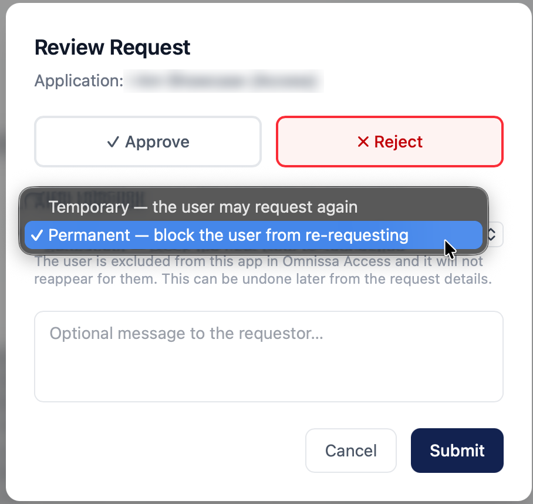

*Figure 5 — the two decline modes. The wording states the consequence rather
than the direction of the decision.*

**On-demand revoke.** Any approved request can be revoked without waiting for a
TTL: **Revoke access** (the app returns to a requestable state after a short
hold) or **Revoke and block** (the exclusion stays until an administrator lifts
it).

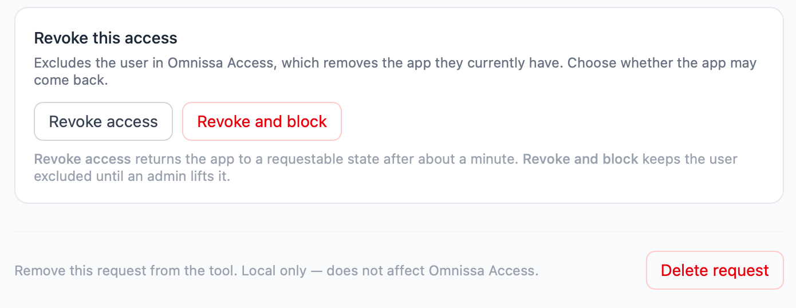

*Figure 6 — revoke controls on an approved request, and the separate local-only
Delete request action (2.12).*

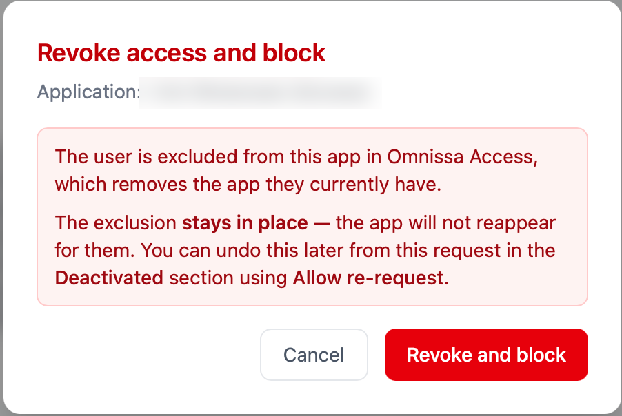

*Figure 7 — Revoke and block spells out that the exclusion persists, and names
the control that undoes it.*

**Allow re-request.** Any blocked record — from a permanent decline, a revoke
and block, or a one-time grant that expired — offers **Allow re-request**, which
removes the exclusion and lets the user request the app again.

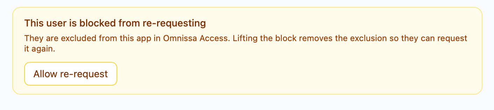

*Figure 8 — Allow re-request on a deactivated record: the recovery path out of
any blocked state.*

**How revocation actually works.** Access does not offer a "remove this user's
access" call that works for group-entitled applications. The tool instead writes
a **per-user exclusion** (a negative entitlement), which overrides a group grant
for one person while leaving the group entitlement untouched. Restoring deletes
that exclusion for a group-assigned user, or re-provisions a directly-assigned
user with their **original Deployment Type**, which is captured at grant time
rather than assumed.

> **Deployment Type decides what happens when an exclusion lifts.**
> With **Automatic**, Omnissa Access re-provisions the app immediately — the user
> never requests it, so no approval occurs and an auto-approval rule is not
> involved. With **User-Activated**, the app simply reappears in the catalog as
> requestable; nothing is granted until the user clicks **Request**, at which
> point a matching auto-approval rule may approve it instantly. An auto-approval
> rule never returns access on its own — it acts on the *next request*, which
> only exists under User-Activated.

A revoke or block that cannot be applied is **never recorded as if it
succeeded**.

### 2.4 Roles and Access Control

Authorization is driven by **Omnissa Access group membership**, so there is no
second user directory to maintain.

| Role | Permitted |
|---|---|
| **Admin** | Users, auto-approval rule changes, tenant configuration, log bundle, request deletion — plus everything below |
| **Approver** | Decide requests: approve, reject, revoke, revoke-and-block, allow re-request |
| **Viewer** | Read the queue, request details, statistics, rules and the audit trail |
| **Auditor** | The audit trail and its CSV export only — no live queue, no decisions |

Configure with `OMNISSA_ROLE_MAP` as comma-separated `<groupId>:<ROLE>` pairs.
Sign in and open `/api/auth/claims` to read your tenant's group ids paired with
their display names.

Points that matter in practice:

- **Matching is on group *ids*, not names.** Renaming a group in Access would
  otherwise silently drop everyone to Viewer with no error anywhere.
- **Requires the `group` scope** on the OIDC client. Without it Access emits no
  group claim at all and every user silently becomes a Viewer.
- **Viewer is a fallback, not a floor.** A user whose groups match nothing gets
  Viewer; once any group matches, the matched roles are exactly what they hold.
  With no map configured *every* user is a Viewer, so setting the map is the
  deliberate act that grants privilege.
- **Matched roles are additive and the most permissive wins.**
- **Changes apply at next sign-in** — roles come from the token, which is a
  snapshot.
- **Do not combine Auditor with another role.** It is the only restrictive role,
  so pairing it with any other silently defeats it; alongside Admin or Approver
  it is also a separation-of-duties conflict. The tool logs a warning at sign-in
  when it sees this.
- **Use groups created for this purpose.** Mapping an existing operational group
  means anyone added to it for unrelated reasons silently gains the ability to
  revoke and block entitlements in your tenant.

**Bulk export is gated separately from reading**, because an export is an
extraction rather than a read — it produces a file that leaves the tool's
controls entirely. A Viewer may read the audit trail on screen but not download
it.

### 2.5 Audit Trail

Every event is recorded with full attribution: request received, deactivation
received, approval, rejection, auto-rule decisions, undeliverable decisions,
revocations, blocks, account changes.

Each entry records both **who acted** and **who the access was for**. The second
is stored on the event rather than looked up through the request, because an
administrator can delete a request record while its audit history remains —
without it, the subject of every entry would become unrecoverable.

Human decisions carry the deciding administrator's identity; rule decisions carry
the rule number. Every audit entry is also written to the application log with an
`AUDIT` prefix, so the same events flow into the downloadable log bundle and any
configured syslog destination.

**Exports.** `Export audit trail` downloads the trail itself (timestamp, actor,
action, request, application, requester, message). `Export requests` downloads
the request table. Both are on the Audit tab; both are restricted — see 2.4.

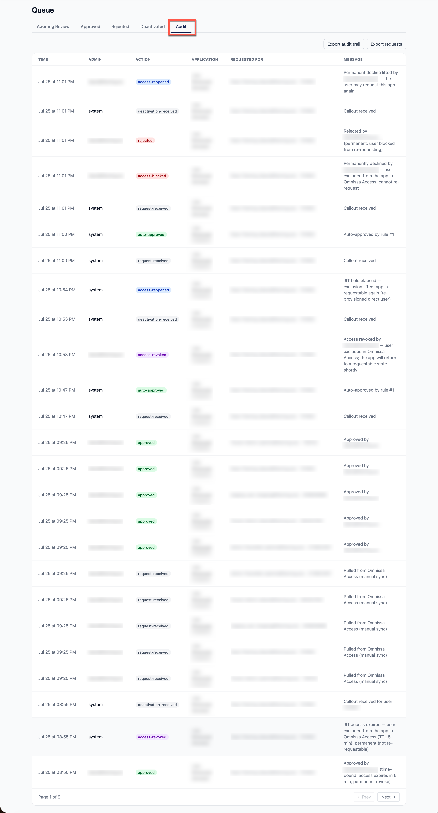

*Figure 9 — the Audit tab. Note the separate ADMIN and REQUESTED FOR columns,
`system` as the actor for rule and sweep decisions, and messages that state the
consequence rather than the direction.*

### 2.6 Auto-Approval Rules

The Rules page manages two rule types:

- **Match rules** decide requests the moment they arrive. Each rule sets an
  action (approve or reject), an application-name pattern, and an optional Access
  group. Pattern matching is case-insensitive against the full application name;
  `*` matches any sequence of characters and may appear multiple times. Group
  matching is an exact, case-insensitive comparison against the requesting user's
  group list. Approve rules may grant time-bound access.
- **Expiry rules** auto-reject requests left pending longer than a chosen number
  of days, evaluated hourly. They accept the same optional application-name
  pattern and group as a match rule; leaving both blank — the usual case —
  expires every stale request.

**Precedence:** rules evaluate in ascending rule number (creation order); the
first enabled matching rule wins and later rules are ignored. All rule decisions
appear in the audit trail and fire decision webhooks with rule attribution.

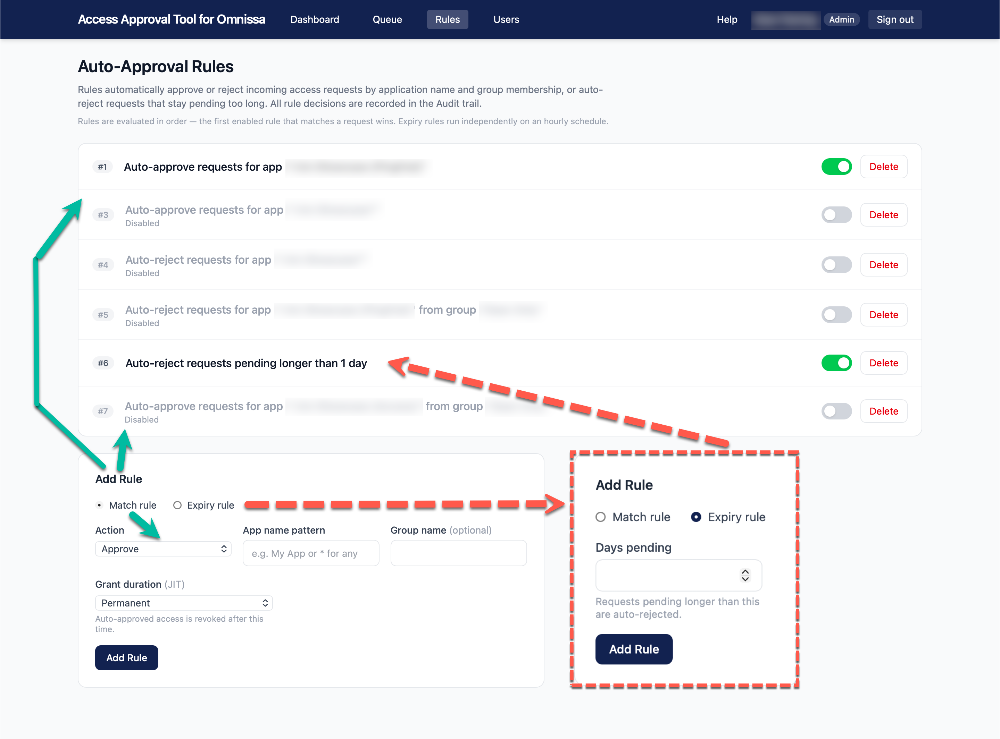

*Figure 10 — the Rules page. Rules carry their evaluation number, may be
disabled without deleting, and the Add Rule panel switches between the match
form (left) and the expiry form (right).*

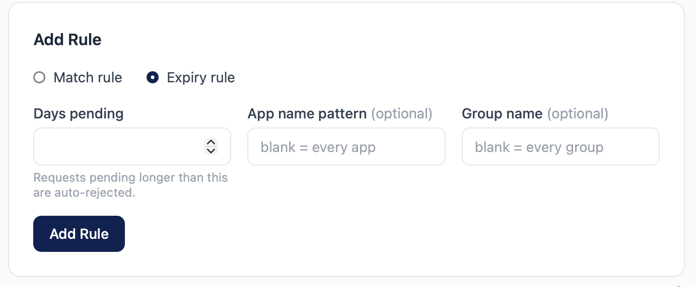

*Figure 11 — the expiry form close up. Application pattern and group are
optional and scope which stale requests the rule rejects; leaving both blank —
the usual case — expires every one of them.*

### 2.7 Chat Approvals — Slack and Teams

New requests can post to Slack or Microsoft Teams with **Approve**, **Reject**
and **Open request** buttons. On both platforms those buttons are **deep links**:
they open the request in the tool with the decision pre-selected, the approver
signs in, and the ordinary role rules apply.

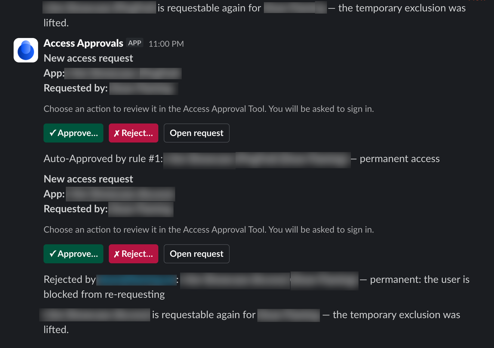

*Figure 12 — Slack. New requests carry the three buttons; lifecycle events
(auto-approval, decisions, expiry, exclusions lifting) post as follow-up
messages stating the consequence.*

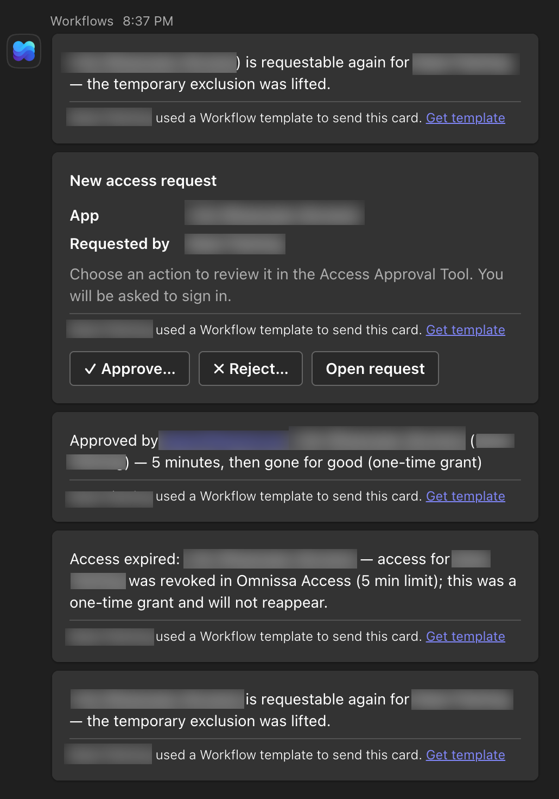

*Figure 13 — the same flow in Microsoft Teams via a Power Automate workflow.*

**Why deep links rather than deciding in chat.** A Slack interaction callback
arrives at an endpoint where no signed-in user exists — the signature proves the
workspace, not the person. Authority therefore had to come from a separate
approver list, which drifted from Access group membership and failed *open*:
removing someone in Access revoked their web access immediately but left their
Slack buttons working. Deep links remove the divergence by construction, and with
it an inbound endpoint, a signing secret and a replay window. Teams works the
same way, additionally because Office 365 connectors are retired and a Power
Automate callback would require the premium HTTP connector.

**Setup is four values** in the env file for either platform: `WEBHOOK_URL`,
`WEBHOOK_FORMAT` (`slack` or `teams`), the matching `SLACK_ACTIONABLE` /
`TEAMS_ACTIONABLE` flag, and `APP_BASE_URL`. `APP_BASE_URL` is mandatory:
notifications are sent from a background thread with no HTTP request, so the
public URL cannot be derived from forwarded headers. If it is blank the tool
sends plain text rather than emitting broken links.

> **Channel membership is not authorization.** The message is posted to a
> channel, so **every member of that channel can read the request details** —
> application, requester and timing — regardless of role, or of whether they have
> an account at all. Roles govern who may *act*, never who may *see*. Treat an
> approvals channel as having the same audience as the request queue itself.

**A Teams caveat.** Power Automate returns `202 Accepted`, meaning the trigger
was queued — not that the message reached the channel. A successful send proves
the endpoint accepted the request and nothing more.

### 2.8 Webhook Notifications

Outbound webhooks fire on new requests, decisions, expiry, revocation and
re-opening, in a format chosen by `WEBHOOK_FORMAT` (`generic`, `slack`,
`teams`).

Decisions state their **consequence**, not just their direction:

- *— permanent access*
- *— 5 minutes, then requestable again*
- *— 1 hour, then gone for good (one-time grant)*
- *— temporary: the user may request again*
- *— permanent: the user is blocked from re-requesting*

The detail is derived from what was **persisted**, so a block that could not be
applied in Access is never announced as though it took effect. The `generic`
format additionally carries `permanent`, `accessTtlMinutes` and `reRequestable`
as structured fields.

Delivery is asynchronous with five-second timeouts; a failure logs a warning and
never blocks request ingestion or decisions.

### 2.9 Administrator Sign-In

- **Local account** — created on first startup from container environment values.
- **Sign in with Omnissa Access** — OIDC authorization-code flow with PKCE.
  Roles are resolved from the group claim (2.4).
- **OAuth-only mode** — `OMNISSA_AUTH_LOCAL_LOGIN_DISABLED=true` disables local
  username/password sign-in entirely.
- **Consent auto-disable** — after confirming OIDC login works, the tool can
  disable the Access consent prompt on its own client through the tenant admin
  API.
- **Access sign-in is genuinely optional.** Leave the admin OAuth client-id
  unset and the tool starts on local sign-in alone, with no OAuth button
  advertised. This is the supported first-run state: stand the container up,
  confirm it serves, then add the tenant. A client-id set without an issuer
  also starts, logging an error naming the missing property — failing to start
  is not recoverable, running with one sign-in method is.

**Sign-in throttling.** Repeated failed local sign-ins are progressively delayed,
and an address making sustained attempts is refused with HTTP 429. Counters
expire on their own and clear on success.

> **There is deliberately no account lockout.** Locking an account after N
> failures would let anyone able to reach the login page disable the one
> credential that exists for emergencies — precisely when Access is unavailable
> and local sign-in is the only way in. The per-address counter may refuse; the
> per-username counter only ever delays, because it is shared with the account's
> real owner and an attacker distributed across addresses could otherwise lock
> them out.

### 2.10 Local Account Management

Administrators manage local accounts on the **Users** page: create, reset
password, enable/disable, change roles, delete. Any locally signed-in user can
change their own password from the top bar, without needing an administrator.
All of these are audited.

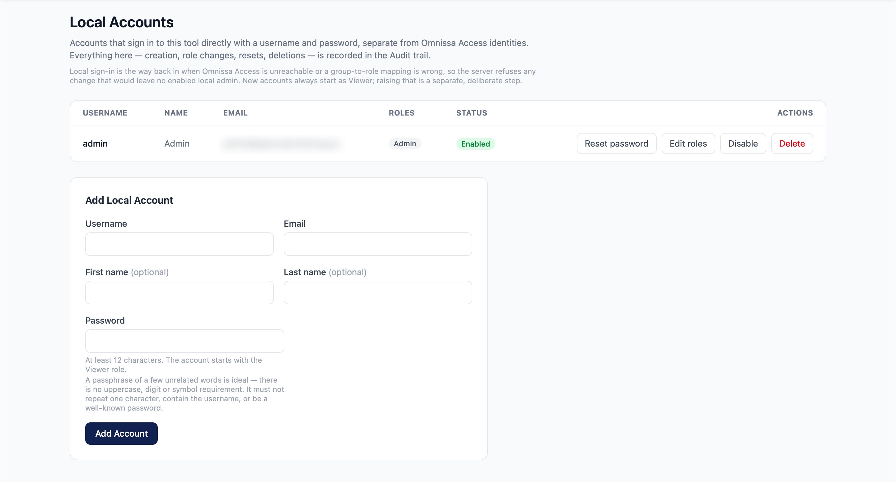

*Figure 14 — the Users page. New accounts always start as Viewer; raising that
is a separate, deliberate step.*

> **The bootstrap variables cannot rotate a password.**
> `OMNISSA_BOOTSTRAP_ADMIN_PASSWORD` is read only when the user table is empty,
> so changing it on an existing install does nothing — silently. Use **Reset
> password** on the Users page.

**The last enabled local administrator cannot be disabled, deleted or demoted.**
Local sign-in is the break-glass route, and an Access user holding Admin through
a group does not satisfy this guard — the situations break-glass exists for are
exactly those where Access sign-in is unavailable.

**Password policy** (all configurable, see Section 6): at least 12 characters, a
minimum number of distinct characters, not a well-known password, not a plain
sequence, and not containing the username. There is deliberately **no
uppercase/digit/symbol requirement** by default — such rules push people towards
predictable shapes like `Password1!` while adding little entropy and rejecting
strong passphrases. They can be enabled for a compliance requirement.

### 2.11 Health and Monitoring

Two health signals, deliberately separate, because "the container is down" and
"something it depends on is unhealthy" need different responses.

| Endpoint | Auth | Answers |
|---|---|---|
| `/actuator/health` | public | **Liveness only** — is the container running? |
| `/api/health/deps` | public | Aggregate dependency status: `UP` / `DEGRADED` / `DOWN` |
| `/api/health/dependencies` | session | Full per-component detail |

`/actuator/health` deliberately ignores dependencies. Docker, the deployment
script, CasaOS and the UAG all consume it — and CasaOS *recreates the container*
when it fails, while the UAG de-pools the backend. Letting a tenant outage turn
it red would take down a healthy service in response to someone else's problem.

Components checked:

| Component | Degraded when |
|---|---|
| `omnissaAccess` | Configured but a token fetch fails |
| `scheduler` | A JIT sweep has not completed for ~5 minutes, or the hourly rule sweep for ~3 hours |
| `approvalDrift` | Access holds approval requests the queue has no pending record of |
| `notifications` | Three consecutive webhook delivery failures |

The **scheduler** check is the most valuable: every scheduled job shares a single
thread, so if the JIT sweeps stall, **time-bound access silently never expires**
while the container, the UI and every other check stay green.

The **drift** check catches requests Access is waiting on that never reached the
tool — a lost callout, a proxy misconfiguration, an outage. Access holds an
approval open until it receives a decision, so those requesters wait indefinitely
and the app never provisions. The queue shows a banner and **Pull from Access**
recovers them.

**Uptime Kuma:** an HTTP monitor on `/actuator/health` for outages, and a Keyword
monitor on `/api/health/deps` matching `"status":"UP"` for warnings, routed to
different notifications. **UAG:** point the health monitor at `/actuator/health`,
never at the dependency endpoint — UAG stops routing to a backend it considers
unhealthy.

### 2.12 Deleting Requests

Administrators can delete a local request record — for cleanup after testing.
This is two-step confirmed, fully audited, and **never touches Omnissa Access**.

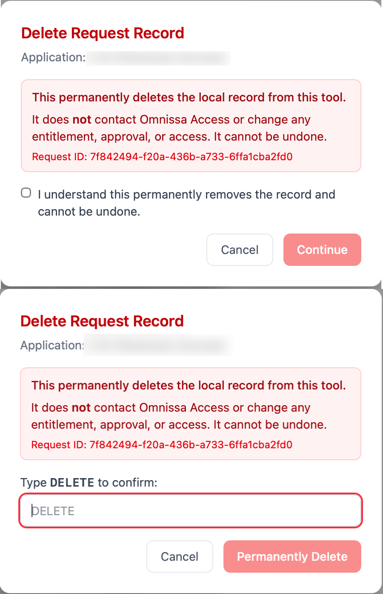

*Figure 15 — deletion is two-step: acknowledge the consequence, then type
DELETE. Both steps restate that Access is not contacted.*

**Deleting a request that is still pending is refused** (HTTP 409). Access holds
the approval open until it receives a decision, so deleting the local record
would leave the requester waiting permanently on a decision that could never be
given. Decline it first; a decided record deletes harmlessly.

### 2.13 API Hardening

- **Optional Basic authentication** on the inbound callout endpoint, matching the
  Username/Password fields in the Access approvals settings. Access's
  unauthenticated OPTIONS probe is always allowed.
- **Per-IP rate limiting** on the callout endpoint (default 60 requests/minute,
  X-Forwarded-For aware), returning HTTP 429 on excess.
- Every other endpoint requires an authenticated session **and a sufficient
  role**. `/api/**` returns a JSON 401 rather than redirecting, so an expired
  session is distinguishable from an empty successful response.

### 2.14 Expired-Request Handling

When a decision reaches Access for a request the tenant no longer knows, the tool
marks the local request **Expired**, moves it into the Deactivated tab, records a
`decision-undeliverable` audit event, fires a webhook, and tells the reviewer
what happened. Transient failures (Access unreachable) keep the request pending
and prompt a retry instead.

### 2.15 Logs, Syslog and Backup

- **Log bundle** — Help → *Download Log Bundle* produces a ZIP of recent
  application log lines, including all `AUDIT` entries. Admin only.
- **Syslog forwarding** — point `SYSLOG_HOST` at your collector. UDP (default),
  TCP, or TLS with optional mutual-TLS client certificates.
- **Backup and restore** — `deploy/zimacube/backup.sh` archives the H2 database
  and the env file with verification, retention, and a manifest recording the
  running image digest. Archives contain secrets and are written `0600` inside a
  `0700` directory; treat a copy as equivalent to the env file.

### 2.16 Built-In Help

The Help page documents everything in this section from inside the app, with a
contents list for navigation — tenant setup, roles, the access lifecycle,
configuration reference, webhook examples, monitoring, update paths. It is
readable by every role, including Auditor.

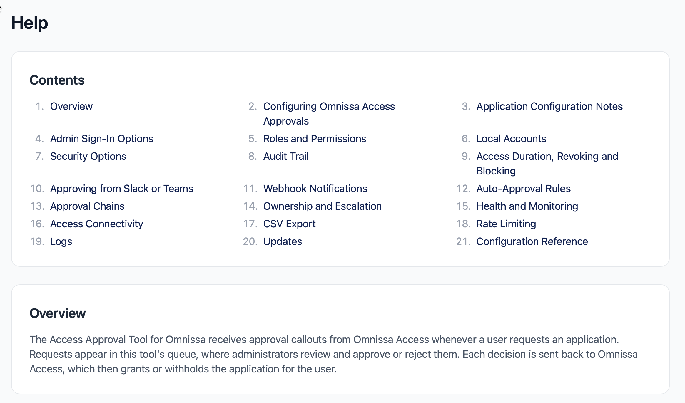

*Figure 16 — the Help page and its nineteen-section contents list. Each entry
jumps to its section, and each section offers a back-to-top link.*

---

## 3. Requirements

| Requirement | Detail |
|---|---|
| Omnissa Access tenant | Administrator access to create OAuth clients and enable approvals |
| Container host | Any Docker/Compose host; ~1 GB RAM is comfortable |
| Inbound HTTPS | One path — `/api/approvals/new` — must be reachable from the internet with valid public TLS and public DNS, because the Access cloud POSTs callouts to it. The admin UI may remain LAN-only |
| Reverse proxy | TLS termination with X-Forwarded headers passed through. For live queue updates behind nginx, disable proxy buffering on `/api/approvals/stream`. If your gateway allow-lists paths, see 4.2 — it is the only place valid paths are enumerated |
| SMTP | **Optional.** Without `SPRING_MAIL_HOST` the tool runs normally and logs a warning when a decision would have e-mailed the requester |
| Omnissa Access OAuth clients | **Optional at first run.** The tool starts without them, on local sign-in, so you can verify the deployment before configuring the tenant |

---

## 4. Deployment

### 4.1 Quick Start (any Docker host)

```bash
docker pull ghcr.io/squidlyman/omnissa-access-approvals:latest

docker run -d --name omnissa-approvals --restart unless-stopped \
  -p 8081:8081 \
  --env-file ./omnissa-approvals.env \
  -v ./data:/app/data \
  ghcr.io/squidlyman/omnissa-access-approvals:latest
```

Copy the environment template from the repository
(`deploy/zimacube/omnissa-approvals.env.example` is the complete annotated
reference), fill in the required values (Section 6), and place a TLS reverse
proxy in front. All persistent state lives under `/app/data`.

### 4.2 Reverse Proxy Notes

- Terminate TLS at the proxy and forward `X-Forwarded-Proto/Host/Port`; without
  them, OAuth redirect URIs generate as `http://` and login fails.
- Server-Sent Events power the live queue: on nginx, add a location for
  `/api/approvals/stream` with `proxy_buffering off`.
- **Allow-list the paths that exist.** A gateway that matches a pattern — the
  Unified Access Gateway's `proxyPattern` is the common one — should be
  default-deny. It decides what reaches an internal system at all, and it is the
  only control still standing if the container is misconfigured or a later
  release exposes something unnoticed. The current valid set:

```
(/|/login(/.*)?|/logout|/oauth2(/.*)?|/dashboard|/queue|/rules|/users(/.*)?|/help|/requests(/.*)?|/assets(/.*)?|/favicon\.ico|/api(/.*)?)
```

  `/requests(/.*)?` must accept a child path — chat approval buttons are deep
  links of the form `/requests/{id}?action=approve`. `/login(/.*)?` and
  `/oauth2(/.*)?` carry the OAuth redirect and callback. `/actuator/health` is
  deliberately absent: a UAG health monitor connects directly to the internal
  resource and does not traverse the pattern.

  Keeping the list accurate is the real work, and the failure is quiet — a page
  added to the application but not the gateway works when clicked, because the
  browser never asks the proxy, and 404s on refresh or from a chat link. The
  build verifies the published pattern against the routes the application
  declares, so it cannot silently fall behind.

### 4.3 Opinionated NAS Deployment (ZimaCube)

The repository ships a complete, idempotent deployment under `deploy/zimacube/`:
a bootstrap script handling checkout, environment scaffolding, image pull, LAN-IP
auto-detection, a LAN-only firewall rule with systemd persistence, and health
verification. The same folder holds the Compose file, firewall unit template, and
the backup/restore scripts.

### 4.4 Updates

- **Manual:** `docker compose pull && docker compose up -d`, or re-run
  `deploy.sh`.
- **Automatic (opt-in, disabled by default):** a Watchtower service ships behind
  the `autoupdate` Compose profile. It is label-scoped so it can only touch this
  application's container.

> **The CasaOS "Check and then update" button does not work for this container,
> and no image tag changes that.** ZimaOS decides whether an update exists by
> looking the app up in a CasaOS AppStore; an externally-managed Compose app is
> never found there, so the check reports "latest version" **without ever
> contacting the registry**. Use the paths above, and trust the version shown on
> the dashboard.

---

## 5. Omnissa Access Tenant Setup

### 5.1 Service Client (decision delivery)

1. Access console → **Settings → OAuth 2.0 Management** → create a client: type
   **Service Client Token**, grant **Client Credentials**, suggested name
   `ApprovalService`. Grant admin rights if you plan to use consent auto-disable.
2. Copy Client ID and Secret into `OMNISSA_BOOTSTRAP_CLIENT_ID` /
   `OMNISSA_BOOTSTRAP_CLIENT_SECRET`, and the tenant hostname (no scheme) into
   `OMNISSA_BOOTSTRAP_URL`.

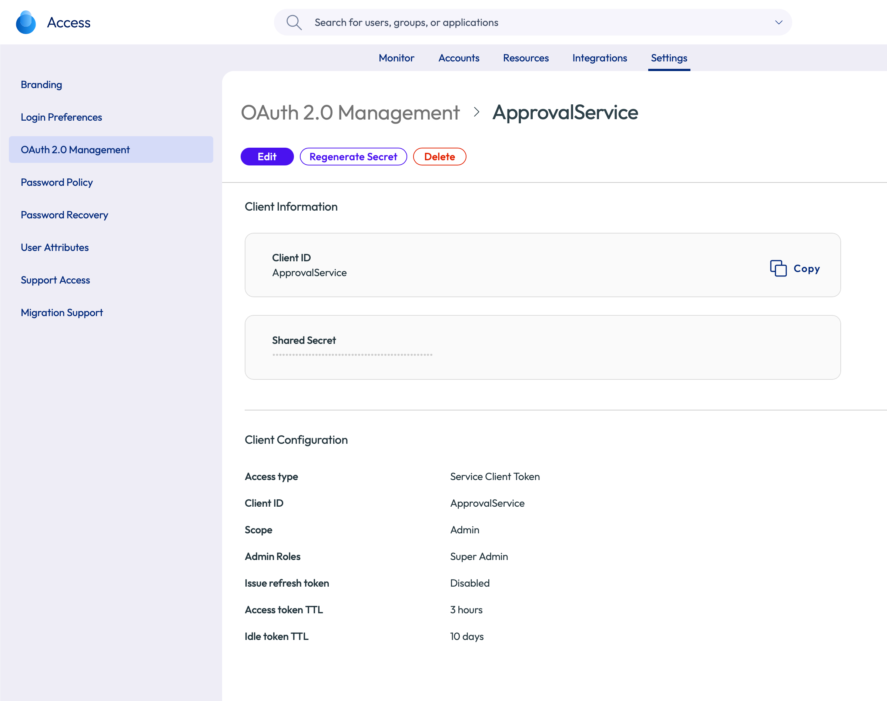

*Figure 17 — service client in Omnissa Access (Service Client Token, admin scope).*

### 5.2 OIDC Admin Login Client

1. Create a second client: type **User Access Token** (confidential), grant
   **authorization_code** (PKCE enforced is fully supported), scopes
   **`openid email profile group`**, redirect URI
   `https://<your-host>/login/oauth2/code/omnissa`.
2. Set `OMNISSA_ADMIN_OAUTH_ISSUER_URI` to `https://<tenant>/SAAS/auth` — the
   issuer advertised in the tenant's OIDC discovery document, **not** `/acs`.
3. Create the groups that will drive roles — dedicated groups such as
   *App Approval Admins* / *Approvers* / *Auditors*, not existing operational
   groups — and map them with `OMNISSA_ROLE_MAP`.

> **The `group` scope is required for roles.** Without it Access emits no
> `group_names` / `group_ids` claim, no group matches, and every signed-in user
> silently becomes a Viewer. Confirm your tenant advertises it in
> `scopes_supported` at `https://<tenant>/SAAS/auth/.well-known/openid-configuration`.

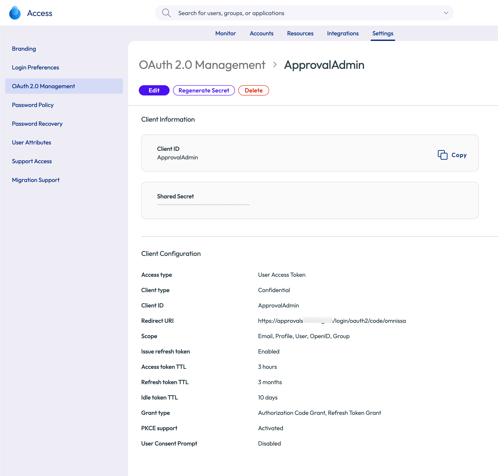

*Figure 18 — OIDC admin login client (authorization code + PKCE). Note: the scope
list must also include `group` for role resolution.*

### 5.3 Approvals Settings

**Resources → Web Apps → Settings → Approvals:** Enable Approvals = Yes, Approval
Engine = **REST API**, URI = `https://<your-host>/api/approvals/new`.
Username/Password only when API Basic authentication is enabled on the tool.
Saving triggers an OPTIONS probe against the URI — a failure here usually means
DNS, TLS, or reachability problems (Section 9).

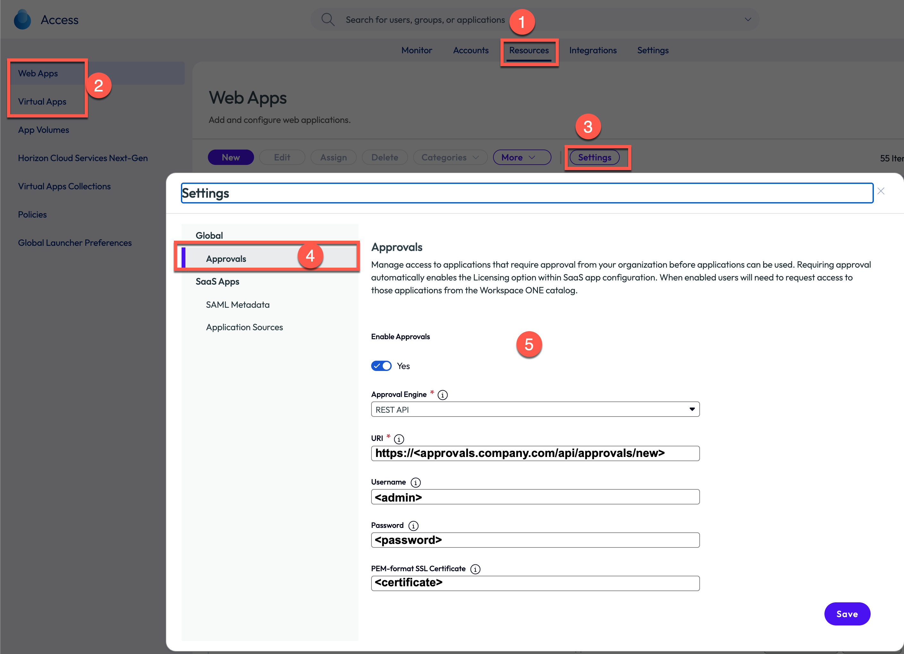

*Figure 19 — Settings → Approvals: REST API engine pointed at the callout URI.*

### 5.4 Putting Applications Behind Approval

Edit each application and enable **License Approval Required** (pricing fields
are optional). The assignment deployment type then drives the flow:
**User-Activated** shows a REQUEST button in the catalog and a PENDING state
while admins decide; **Automatic** sends the approval request without user
action; **Excluded** deactivates and hides the application, with the deactivation
recorded in the tool.

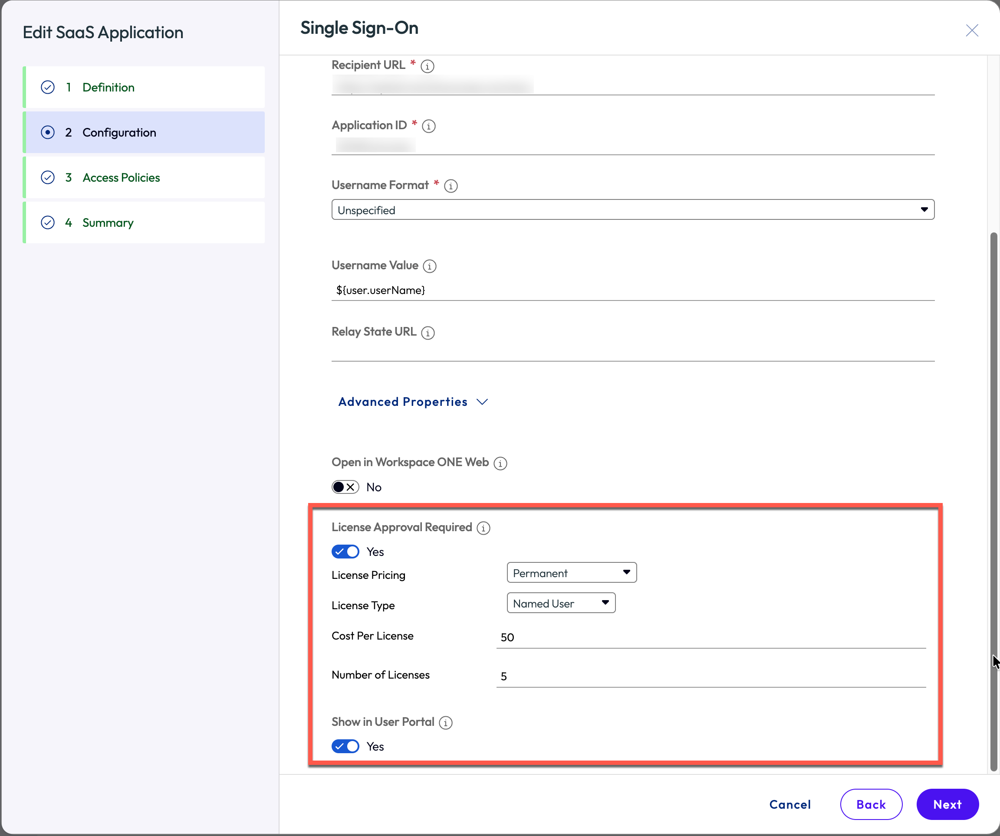

*Figure 20 — License Approval Required on an application.*

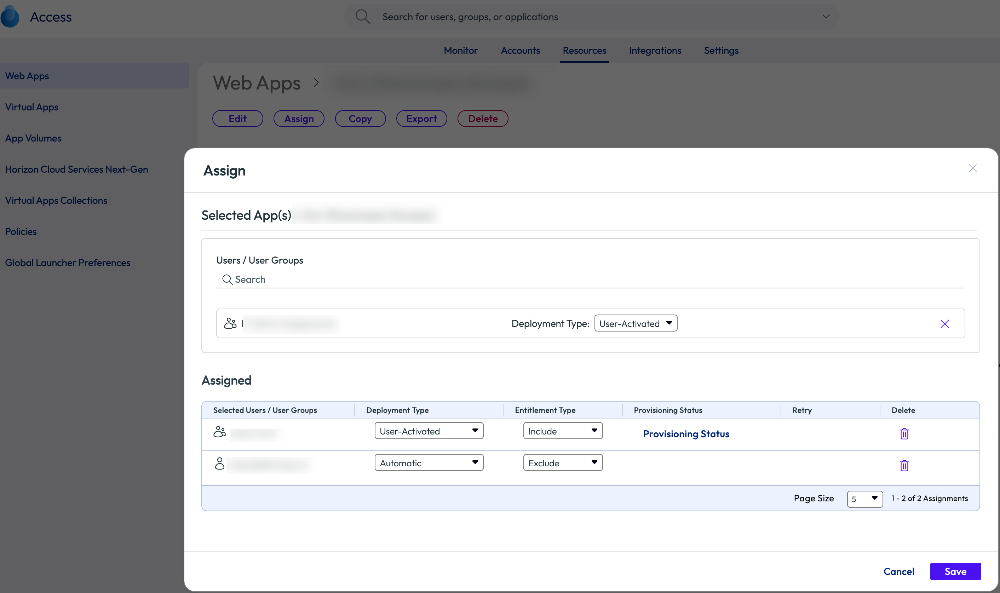

*Figure 21 — assignment deployment type selection (User-Activated / Automatic).*

---

## 6. Configuration Reference

All settings are container environment values. Required rows are marked ●.

### 6.1 Tenant and Sign-In

| Variable | Default | Purpose |
|---|---|---|
| ● `OMNISSA_BOOTSTRAP_URL` | — | Tenant hostname, no scheme |
| ● `OMNISSA_BOOTSTRAP_CLIENT_ID` | — | Service client ID |
| ● `OMNISSA_BOOTSTRAP_CLIENT_SECRET` | — | Service client secret |
| `OMNISSA_BOOTSTRAP_ADMIN_USERNAME` | — | First-run local admin username (created **only** when the user table is empty) |
| `OMNISSA_BOOTSTRAP_ADMIN_PASSWORD` | — | First-run local admin password. **Cannot rotate an existing password** — use the Users page |
| `OMNISSA_BOOTSTRAP_ADMIN_EMAIL` | — | First-run local admin email |
| `OMNISSA_ADMIN_OAUTH_CLIENT_ID` | — | OIDC admin login client ID (blank disables OIDC login) |
| `OMNISSA_ADMIN_OAUTH_CLIENT_SECRET` | — | OIDC client secret |
| `OMNISSA_ADMIN_OAUTH_REDIRECT_URI` | — | Must exactly match the URI registered in Access |
| `OMNISSA_ADMIN_OAUTH_ISSUER_URI` | — | `https://<tenant>/SAAS/auth` (never `/acs`) |
| `OMNISSA_ADMIN_OAUTH_SCOPE` | `openid,email,profile,group` | Requested scopes. **`group` is what makes roles work** |
| `OMNISSA_ADMIN_OAUTH_DISABLE_CONSENT` | `false` | Disable the Access consent prompt at startup |
| `OMNISSA_AUTH_LOCAL_LOGIN_DISABLED` | `false` | `true` = OAuth-only sign-in. Consider leaving local login enabled as break-glass |

### 6.2 Roles

| Variable | Default | Purpose |
|---|---|---|
| `OMNISSA_ROLE_MAP` | — | Comma-separated `<groupId>:<ROLE>` pairs. Roles: `ADMIN`, `APPROVER`, `VIEWER`, `AUDITOR`. **Blank = every user is a Viewer** |

### 6.3 Password Policy

| Variable | Default | Purpose |
|---|---|---|
| `OMNISSA_PASSWORD_MIN_LENGTH` | `12` | Minimum length, **clamped to a floor of 8** |
| `OMNISSA_PASSWORD_MIN_DISTINCT` | `5` | Distinct characters required |
| `OMNISSA_PASSWORD_BLOCK_USERNAME` | `true` | Reject a password containing the username |
| `OMNISSA_PASSWORD_BLOCKLIST_FILE` | — | Extra wordlist merged with the bundled list |
| `OMNISSA_PASSWORD_REQUIRE_MIXED_CASE` | `false` | Composition rule — not recommended |
| `OMNISSA_PASSWORD_REQUIRE_DIGIT` | `false` | Composition rule — not recommended |
| `OMNISSA_PASSWORD_REQUIRE_SYMBOL` | `false` | Composition rule — not recommended |

> **Why the bundled blocklist is small.** Of the 10,000 most common passwords,
> only 10 reach 12 characters — the length rule alone rejects the other 9,990.
> The bundled list therefore targets values long enough to pass the minimum yet
> still trivially guessable: doubled words, keyboard walks, digit runs. Those
> also defeat composition rules, since `Passwordpassword1!` satisfies every
> character-class requirement. If you **lower** the minimum length, point
> `OMNISSA_PASSWORD_BLOCKLIST_FILE` at a real wordlist.

### 6.4 API Security, Notifications and Logging

| Variable | Default | Purpose |
|---|---|---|
| `OMNISSA_API_USERNAME` / `_PASSWORD` | — | HTTP Basic auth on the callout endpoint |
| `OMNISSA_API_RATE_LIMIT` | `60` | Callout requests/minute per source IP; `0` disables |
| `SERVER_PORT` | `8081` | HTTP listen port |
| `APP_BASE_URL` | — | Public URL. **Required** for Slack/Teams deep links |
| `WEBHOOK_URL` | — | Notification destination; blank disables |
| `WEBHOOK_FORMAT` | `generic` | `generic`, `slack`, or `teams` |
| `WEBHOOK_NOTIFY_LIFECYCLE` | `true` | Also notify on revoke/re-open events |
| `SLACK_ACTIONABLE` | `false` | Add deep-link decision buttons to Slack messages |
| `TEAMS_ACTIONABLE` | `false` | Post an Adaptive Card with deep-link buttons |
| `SPRING_MAIL_HOST` / `_PORT` / `_USERNAME` / `_PASSWORD` / `SPRING_MAIL_FROM` | — | Optional SMTP for requester notifications. Connect, read and write timeouts default to 10s — Jakarta Mail's own default is infinite, and mail is sent synchronously |
| `SYSLOG_HOST` / `_PORT` / `_PROTOCOL` | —/514/udp | Syslog forwarding; `udp`, `tcp`, or `tls` |
| `SYSLOG_CLIENT_CERT_FILE` / `_KEY_FILE` / `CA_FILE` | — | Mutual-TLS syslog (file paths preferred; PEM-inline variants also exist) |

---

## 7. Proof-of-Concept Walkthrough

A complete demonstration takes roughly thirty minutes on a fresh tenant.

1. **Deploy the container** (4.1) with the three required tenant values plus a
   local admin username/password. Confirm `/actuator/health` returns
   `{"status":"UP"}`.
2. **Publish it** behind your TLS reverse proxy and confirm the login page loads.
3. **Create the two OAuth clients** (5.1–5.2), including the **`group`** scope,
   and restart with the OIDC values filled in. Sign in with Omnissa Access; the
   dashboard tile should read **Connected**.
4. **Create the role groups** in Access, read their ids from `/api/auth/claims`,
   and set `OMNISSA_ROLE_MAP`. Sign out and in; confirm your role badge.
5. **Enable approvals** (5.3) and save — a successful save proves Access can
   reach your endpoint.
6. **Gate a test application**: enable License Approval Required and assign it
   User-Activated to a test user.
7. **Request it** from the user's catalog. The app shows PENDING; within seconds
   the request appears in the queue — live, no refresh.
8. **Approve it for five minutes.** The catalog entry becomes launchable, the
   Audit tab records the decision with the requester's name, and your chat
   channel receives the notification stating *"5 minutes, then requestable
   again"*.
9. **Wait for expiry.** Within a minute of the TTL elapsing the app is revoked in
   Access and disappears from the user's catalog; shortly after, the exclusion
   lifts and the app becomes requestable again.
10. **Reject and block** a second request, then use **Allow re-request** to
    demonstrate the recovery path.
11. **Add a match rule** (e.g. auto-approve `*Demo*` for group "IT Admins") and
    request a matching app: the decision lands instantly, attributed to the rule.
12. **Finish with the exports** — download the audit CSV and the log bundle, and
    show the AUDIT lines in your syslog collector.

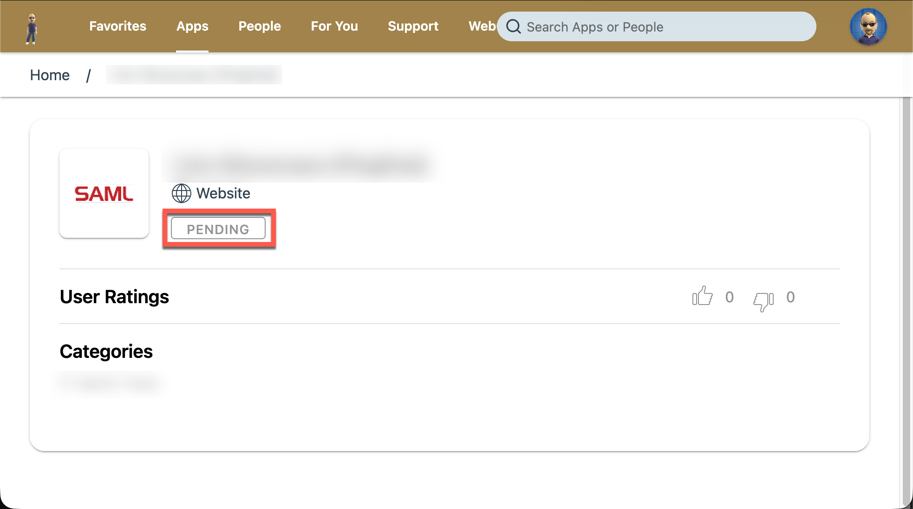

*Figure 22 — the user side: PENDING until somebody, or a rule, says yes.*

---

## 8. Security Posture

- **One intentionally unauthenticated inbound path** —
  `POST /api/approvals/new` — rate-limited, with optional Basic authentication.
  Plus `GET /api/health/deps`, which returns only a status word: no tenant name,
  no error strings, and deliberately no counts, since a drift number would leak
  request volume.
- **Everything else requires an authenticated session and a sufficient role.**
  Rules are enforced centrally rather than scattered across annotations, so the
  whole policy is reviewable in one place.
- **Chat approvals add no inbound endpoint.** Both Slack and Teams use deep
  links.
- **Callout payloads include user directory attributes** from Access — treat the
  H2 database as containing personal data and keep the volume protected.
- **Backup archives contain secrets** (OAuth client secret, SMTP credentials).
  Treat a copy as equivalent to the env file.
- **Secrets arrive exclusively through environment values;** nothing sensitive is
  written to the repository, the image, or the logs.
- **Privileged operations** — permanent decline, revoke and block, allow
  re-request — change entitlements in your tenant, are confirmation-gated, and
  are recorded with the acting identity.
- **Vulnerability reports:** GitHub → Security → "Report a vulnerability"
  (private advisories).

---

## 9. Troubleshooting Quick Reference

| Symptom | Likely cause / fix |
|---|---|
| "Unable to connect to the URI" when saving approvals settings | Public DNS, TLS validity, or reachability of the callout path; the OPTIONS probe must return 200 |
| Requests never appear in the queue | Confirm the URI ends in `/api/approvals/new` and Basic-auth values match both sides. Behind a UAG, keep Identity Bridging **off** for that path — the callout carries no user identity |
| Requests missing, Access thinks they are pending | Use **Pull from Access** on the queue. `/api/health/deps` reports `DEGRADED` for this automatically |
| Every user is a Viewer | The OIDC client is missing the **`group`** scope, or `OMNISSA_ROLE_MAP` uses group *names* instead of ids |
| Role change had no effect | Roles come from the token — the user must sign out and back in |
| OIDC login fails | Issuer must be `https://<tenant>/SAAS/auth` exactly; redirect URI must match exactly |
| Time-bound access never expires | A scheduled sweep has stalled — check the `scheduler` component at `/api/health/dependencies`; restarting the container clears it and nothing is lost |
| App returns immediately after a revoke | Deployment Type is *Automatic* — Access re-provisions with no request involved. Use **Revoke and block** |
| Deleting a request returns 409 | It is still pending and Access is waiting on a decision. Decline it first |
| Teams receives nothing | Confirm the workflow URL is on `*.environment.api.powerplatform.com`; a `webhook.office.com` URL is the retired connector |
| Live updates stall behind nginx | `proxy_buffering off` on `/api/approvals/stream` |
| HTTP 429 on the callout endpoint | Raise `OMNISSA_API_RATE_LIMIT` or identify the flooding source |

---

## 10. Known Limitations

- **Single-tenant:** one Access tenant per deployment.
- **H2 file database:** perfect for POC scale; no clustering or external-database
  option.
- **Not an ITSM system:** no multi-stage approval chains, no delegation, and no
  SLA escalation beyond expiry rules.
- **Slack and Teams are notification channels, not decision surfaces** — every
  decision is made in the tool's own UI after sign-in.
- **Teams delivery cannot be confirmed:** Power Automate returns `202 Accepted`,
  meaning queued.
- **The entitlements API is not guaranteed to be a complete view** of what Access
  uses for authorization. A divergence has been observed once, resolved by
  recreating the application in Access.

---

## 11. Additional Resources

- **Repository & README:** https://github.com/SquidlyMan/Omnissa-Access-Approvals
- **Documentation site:** https://squidlyman.github.io/Omnissa-Access-Approvals/
- **Deployment:** `.../deployment.html` • **Configuration:** `.../configuration.html`
- **Monitoring:** `.../monitoring.html` • **Troubleshooting:** `.../troubleshooting.html`
- **Access lifecycle:** `.../access-lifecycle.html`
- **Slack approvals:** `.../slack-approvals.html` • **Teams approvals:** `.../teams-approvals.html`
- **Tenant setup with screenshots:** `.../omnissa-access-setup.html`
- **Container images:** `ghcr.io/squidlyman/omnissa-access-approvals`
- **Changelog:** `/CHANGELOG.md` • **Issues:** repository Issues tab

> ### ⚠️ REMINDER
>
> **Unsupported. As-is. No warranty. Not an Omnissa product.**
> **Testing and demonstration use only — never production, never production data.**
> **Entirely at your own risk.**
