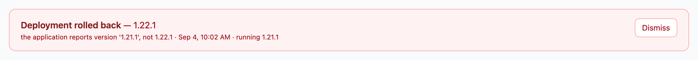
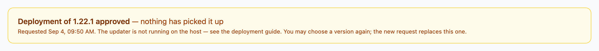

# Troubleshooting

Real failure modes seen in the field, and how to fix them.

## Container will not start: "callout endpoint is reachable without authentication"

The application refuses to start when a tenant is configured
(`OMNISSA_BOOTSTRAP_URL`) but the callout endpoint has no credentials. The log
names both ways out:

```
The Omnissa Access callout endpoint (POST /api/approvals/new) is reachable
without authentication.
```

Do one of these:

1. **Set `OMNISSA_API_USERNAME` and `OMNISSA_API_PASSWORD`**, then enter the same
   values in the Access console under **Settings → Approvals**. Both sides must
   match or Access callouts will be rejected with 401 and requests will stop
   arriving.
2. **Set `OMNISSA_API_ALLOW_UNAUTHENTICATED=true`** if the endpoint genuinely
   cannot be reached from anywhere untrusted. The application starts and repeats
   the warning hourly.

This is deliberately a refusal rather than a warning. An open ingest path that
nobody chose is worth interrupting a deployment for, and a warning in a log is
not read at the moment it matters.

**Upgrading an existing install?** Set one of the two *before* pulling the new
image, or the container will not come back up.

## "Unable to connect to the URI" when saving Settings > Approvals

When you save the approvals settings, the Omnissa Access cloud service
probes your URI with an `OPTIONS` request. The save fails unless **all** of
these hold:

- **DNS resolves publicly.** The hostname in the URI must resolve from the
  internet, not just on your LAN (split-horizon DNS with no public record is
  a common cause).
- **TLS is valid.** The certificate must be publicly trusted, unexpired, and
  match the hostname — self-signed certificates are rejected.
- **The endpoint is reachable.** Port 443 must be open from the internet to
  your reverse proxy, and the proxy must forward `/api/approvals/new` to the
  app.
- **The `OPTIONS` probe returns 200.** The tool answers `OPTIONS
  /api/approvals/new` unauthenticated by design (even with API Basic auth
  enabled). Test from outside your network:

  ```bash
  curl -i -X OPTIONS https://<your-host>/api/approvals/new
  ```

## Callouts arrive but the queue stays empty

Omnissa Access wraps approval callouts in a **messaging envelope** rather
than posting the approval payload directly. The tool parses this envelope
natively, so normally requests just appear. If the queue stays empty:

- Check the container logs: `docker logs <container>`. Lines like
  `Ignoring callout probe` mean Access sent a probe/keep-alive message, not
  an actual request — that is normal and expected.
- Confirm the application actually has **License Approval Required** enabled
  and the assignment deployment type triggers a request (see
  [Omnissa Access setup](omnissa-access-setup.md)).
- If API Basic auth is enabled, verify the Username/Password in
  **Settings > Approvals** match `OMNISSA_API_USERNAME` /
  `OMNISSA_API_PASSWORD` — mismatches show as 401s in the proxy/app logs.

## HTTP 415 Unsupported Media Type on the callout endpoint

Omnissa Access posts callouts with the content type
`application/vnd.vmware.horizon.manager.messaging.message+json`. The tool
accepts this natively (alongside regular `application/json`). If you see
415s, make sure your reverse proxy is not rewriting or filtering the
`Content-Type` header, and that you are running a current version of the
tool.

## OIDC admin login fails

- **Issuer URI must be exact**: `https://<tenant>/SAAS/auth` — the `issuer`
  value from the tenant's `/.well-known/openid-configuration`. Anything
  else (`/SAAS/auth/acs`, the bare tenant host, a trailing slash) breaks
  discovery or ID-token validation.
- **Redirect URI must match exactly** — the value registered on the Access
  client and `OMNISSA_ADMIN_OAUTH_REDIRECT_URI` must both be
  `https://<your-host>/login/oauth2/code/omnissa`, using the public
  hostname (not the backend host or port).
- **PKCE**: Access enforces PKCE on the authorization-code grant; the tool
  supports it — no client change needed.
- Behind a reverse proxy, `X-Forwarded-Proto` must reach the app, or the
  generated redirect URI will be `http://` and Access will reject it.

## Consent screen appears on OAuth2 login

The OIDC client has **User Consent Prompt** enabled. Either disable it in
the Access console, or set `OMNISSA_ADMIN_OAUTH_DISABLE_CONSENT=true` and
restart — the tool disables it automatically via the Access admin API
(requires the service client to have admin rights).

## Health endpoint shows DOWN

`/actuator/health` reports **liveness only** — whether the container is running.
It deliberately ignores Omnissa Access, the scheduler and notifications, because
Docker, CasaOS and the UAG all act destructively on a failure there (CasaOS
recreates the container; the UAG de-pools the backend). A third-party outage
must not restart a healthy service.

So a `DOWN` here means the application itself is broken — check the container
log. Mail cannot cause it (`management.health.mail.enabled=false` exists
precisely so an unreachable SMTP server does not fail the Docker health check).

For dependency problems, look at `/api/health/deps` instead — it reports
`DEGRADED` when Omnissa Access is unreachable, a scheduled sweep has stalled,
approvals have drifted, or webhook delivery is failing. See
[Monitoring](monitoring.md) for the per-component runbook.

## Time-bound access is not expiring

Grants past their TTL stay active and the app is never revoked.

This is the failure with no other outward symptom: the container is up, the UI
works, and every other check is green. The JIT sweeps share one scheduler
thread with the expiry-rule sweep and the callout-auth reminder, so a single
job blocked on a network call stops the rest with it. A liveness check proves
the process is alive, not that its work is happening.

Escalation is the exception: since 1.21.0 it runs on its own pool, so a slow
tenant reached from escalation can no longer stall JIT expiry. It cannot wedge
the sweeps, and the sweeps cannot wedge it.

Check `/api/health/dependencies` — the `scheduler` component reports the age of
each job's last run, including escalation's. Restarting the container clears a
wedged scheduler thread; nothing is lost, because the sweep selects on state
and expiry rather than tracking a cursor, so overdue grants are revoked on the
next pass.

## HTTP 429 on the callout endpoint

The per-IP rate limit was hit — the default is 60 requests/minute per source
IP on `POST /api/approvals/new`. Raise `OMNISSA_API_RATE_LIMIT` or set it to
`0` to disable. Note: if all callouts arrive through a proxy that hides the
client IP, they share one bucket — make sure the proxy passes
`X-Forwarded-For`.

## Live queue updates stall behind nginx

The SSE endpoint `/api/approvals/stream` needs `proxy_buffering off`,
`proxy_cache off`, HTTP/1.1, and a long `proxy_read_timeout` — see the
nginx snippet in [deployment](deployment.md).

## Request stuck in Awaiting Review / decision not delivered

Two distinct failure modes when a decision is submitted:

- **Transient Access outage** (network error, HTTP 5xx): the request stays
  in Awaiting Review and the review dialog shows a red "Could not reach
  Omnissa Access — decision not delivered" error. Try again once the tenant
  is reachable; expiry rules also retry on the hourly scheduler.
- **Request unknown to Access** (HTTP 4xx — the request no longer exists on
  the tenant): the request is marked **Expired** automatically. It moves to
  the Deactivated tab with an Expired badge, the audit trail records a
  `decision-undeliverable` event, and the webhook (if configured) emits
  `request.expired`.

## Still stuck?

Download the **Log Bundle** (last hour) from the in-app Help page, or check
`docker logs`. For suspected security issues, see
[SECURITY.md](../SECURITY.md).

## Requests missing from the queue (held pending in Access)

Omnissa Access pushes each callout once and does not retry. If a push lands during a container restart or a transient network gap, Access keeps the request **Pending** on its side but it never reaches the tool, and re-requesting the same app does nothing (Access already considers it pending).

Fix: on the **Awaiting Review** tab, click **Pull from Access**. The tool fetches every pending request Access is holding and ingests any it does not already have. Safe to click anytime — it only adds requests missing locally.

The queue now **detects this automatically** and shows a banner when Access is
holding requests it has no record of; `/api/health/deps` reports `DEGRADED` for
the same condition. See [Monitoring](monitoring.md#the-drift-check-and-what-it-caught).

Note that deleting a **pending** request locally causes the same divergence, and
is now refused with HTTP 409 for that reason — Access would be left waiting on a
decision that could never be given. Decline it first, then delete the record.

## A deployment was refused, failed, or rolled back

The Dashboard shows the host's verdict in a red box after an approved update
did not stick. The `reason` is the host's own words; the cases:

- **refused — not a release version / no manifest / below the floor and not
  confirmed.** The request never got as far as Docker. Approve it again from
  the console (which validates the same things first); for a rollback below
  1.19.5 the console asks for the version to be typed, and only then does the
  host accept it.
- **rolled back — running digest does not match / the application reports
  version X, not Y.** The pull or recreate did not produce the image the
  registry says that tag is. The previous version is back. Check
  `journalctl -u omnissa-approvals-update` on the host and the registry's tag.
- **rolled back — container never became healthy.** The new version started
  and failed. The previous version is back; `docker logs omnissa-approvals`
  from the failed start is the evidence — a missing environment variable the
  new version requires is the usual cause.
- **rollback-failed — … and the rollback did not come back up.** The new
  version failed *and* the previous one did not start either. This is an
  outage. On the host: `docker logs omnissa-approvals`, then
  `docker compose -p <project> -f <compose file> up -d` (both named in
  `journalctl -u omnissa-approvals-update`), or `sudo sh deploy.sh <version>`.
- **failed — cannot resolve the compose file.** The container was not running
  when the updater fired, or CasaOS moved the compose file. `sudo sh deploy.sh`
  re-resolves and reinstalls the units.
- **failed — cannot detect the LAN address.** The health probe had nowhere to
  go. Set `OMNISSA_UPDATE_HEALTH_URL` in `omnissa-approvals-update.service`
  and `systemctl daemon-reload`.



**Nothing happens after approval.** *Waiting for the host to pick it up* for
more than a minute means the path unit is not watching:
`systemctl status omnissa-approvals-update.path` on the host, and
`sudo sh deploy.sh` (ZimaCube) or `sudo sh deploy/updater/install.sh` (any
other systemd host) to install it. After ten minutes the Dashboard turns the
notice amber and lets a new approval replace the unanswered one.



**The picker is empty and the banner says "no release versions".** The
registry answered but listed nothing that looks like `N.N.N` — an incident on
its side, or `OMNISSA_UPDATE_REGISTRY_REPO` pointing at the wrong repository.
The previous list is kept, so rollback targets are not lost; **Check now**
once it recovers.

**Deployed from the host, but the Dashboard still says rolled back.** A
`deploy.sh <version>` since 1.22.1 writes its own verdict and clears it; on an
older host, delete `update-result` from the control directory.

## Behind a Unified Access Gateway (UAG): disable Identity Bridging

If you publish the tool through a UAG Web Reverse Proxy and enable **Identity Bridging**, Omnissa Access cannot deliver approval callouts and the **Settings > Approvals** page fails to save with **"Unable to connect to the URI."**

Why: the callout endpoint (`POST /api/approvals/new`) and Access's save-time validation probe are **unauthenticated**. Identity Bridging asserts an authenticated identity to the backend for every routed request — an unauthenticated callout has no identity to bridge, so the request fails before reaching the app. Adding the path to the UAG **unSecurePattern** does not help: that only waives front-end authentication, not Identity Bridging.

Fix: **disable Identity Bridging on the reverse proxy for this application.** The tool authenticates its own administrators — "Sign in with Omnissa Access" (OIDC) and local login — so UAG identity bridging is redundant here, and it also conflicts with the app's own OIDC flow. The UAG still terminates TLS and reverse-proxies normally; the callout path stays reachable (rate-limited, and requiring Basic auth once a tenant is configured). To require OIDC sign-in for admins, set `OMNISSA_AUTH_LOCAL_LOGIN_DISABLED=true` — that enforces the same SAML-backed SSO at the application layer instead of the gateway.
